# Stack de Referência — StudyRats

> **Versão:** 1.0  
> **Data:** 17 de Setembro de 2026  
> **Autor:** Arquiteto de Software Sênior (assistindo Maria Clara Miguel e Sthefany Bueno)  
> **Disciplina:** Laboratório de Desenvolvimento de Aplicações Mobile — 2026.2  
> **Base metodológica:** [`projeto2026-SKILLs/mobile-design-doc/SKILL.md`](../projeto2026-SKILLs/mobile-design-doc/SKILL.md) (§Stack de referência, §Diagrama de Componentes, §Implementação)  
> **Documentos correlatos:** [`sintese_arquitetural.md`](../base_infos/sintese_arquitetural.md), [`documento-software.md`](documento-software.md)

Este documento consolida a **Stack de Referência** do StudyRats: a escolha por camada, a alternativa viável e a justificativa técnica, respeitando as restrições do MVP (2 devs, ~60h-aula, orçamento externo zero, offline-first 100%, Clean Architecture com isolamento de SDKs via Ports/Gateways).

---

## 1. Tabela de Stack

| Camada | Escolha Principal | Alternativa Viável | Justificativa |
|---|---|---|---|
| **Framework** | **Expo SDK 57** (managed workflow + dev client) + React Native 0.86 + React 19.2 + **Expo Router** | Bare React Native; Expo SDK 56/55 | Uma base de código para iOS+Android; managed workflow elimina manutenção nativa (2 devs, 60h). RN 0.86/React 19.2 com SDK 57 é o release estável mais recente (jun/2026). Expo Router oferece roteamento baseado em arquivos — cada rota vira o Boundary de entrada da Clean Architecture. Dev client cobre módulos que o Expo Go restringe (secure-store, sqlite) |
| **Persistência Local** | **SQLite** via `expo-sqlite` + **Drizzle ORM** (schema tipado + migrations) | WatermelonDB; Kysely; `expo-sqlite` puro com migrations SQL | Dataset esperado é pequeno/médio (centenas a poucos milhares de registros por usuário, limite RNF04 de 100MB) — a principal vantagem do WatermelonDB (queries reativas em datasets grandes) não se aplica. Drizzle oferece **schema TypeScript-first tipado**, geração automática de tipos, migrations versionadas e nenhum "framework mágico" — encaixa no domínio puro sem vazar ORM para `domain/` |
| **Backend/BaaS** | **Supabase** (Postgres + Auth + Storage + Edge Functions) | Firebase (Firestore + Auth + Storage); backend custom Node/Fastify | BaaS elimina servidor custom para o MVP (0 deploy, 0 custo fixo). Postgres + **RLS** casa com o modelo relacional offline-first do DER remoto; free-tier cobre 500MB Postgres, 2GB Storage e Auth ilimitado. Firebase também é grátis e viável, mas Firestore (documentos) distancia o schema relacional já modelado e as regras de segurança são menos expressivas que RLS por tabela |
| **Autenticação** | **Supabase Auth** (email + senha) + sessão persistida em **`expo-secure-store`** | Firebase Auth + SecureStore; Clerk; Auth0 | Token de sessão **nunca** em `AsyncStorage` puro (RNF06). `expo-secure-store` (Keychain/Keystore) atende o critério de segurança. Supabase Auth integra-se ao mesmo Postgres (`auth.users`) mantendo 1 provedor só |
| **IA/LLM** | **Gemini Flash** (linha Flash do Gemini API — free tier ~1.500 req/dia, ex. `gemini-3-flash`/`gemini-2.5-flash`), chamada **por proxy via Supabase Edge Function** e abstraída por **`AIGateway`** | OpenAI (GPT-4o-mini/GPT-5-mini); Anthropic Claude Haiku; OpenRouter | Free-tier suficiente para o limite de ~10 gerações/dia/usuário com margem. A Edge Function segura a **API key no servidor** (chave de IA nunca viaja dentro do APK) e permite aplicar o limite diário server-side. A interface `AIGateway` no domínio permite trocar de provider sem tocar em regra de negócio |
| **Câmera** | **`expo-camera`** (captura) + **`expo-image-picker`** (seleção) | react-native-vision-camera | API oficial do SDK compatível com managed workflow; isolada atrás de **`CameraGateway`**. vision-camera oferece mais controle de performance, mas exige config nativa que foge do escopo de 60h |
| **Geolocalização** | **`expo-location`** (foreground only) | react-native-geolocation-service (bare); expo-location + background (fora do MVP) | Captura lat/lng ao registrar sessão; foreground-only atende RNF03 (sem tracking em background). Isolada atrás de **`LocationGateway`** |
| **Sincronização** | **Outbox pattern**: fila local `sync_queue` (SQLite) + `@react-native-community/netinfo` + **`SyncGateway`** (Supabase). Resolução de conflito **last-write-wins por `updated_at`**, retry com backoff exponencial (2^n, máx 5min); upload de mídia separado do sync tabular | WatermelonDB sync protocol; Supabase Realtime (push remoto→local); react-query + persistência offline | Outbox é o padrão mais simples e testável para 2 devs: escrita local síncrona (UX "salvo ✓"), sincronização assíncrona e idempotente quando há rede. Realtime fica para pós-MVP (não há colab em tempo real). LWW + UUID no cliente evita colisão de IDs criados offline |
| **Testes Unitários** | **Jest** (`jest-expo` preset) + **@testing-library/react-native** | Vitest | Ecossistema RN/Expo é nativo de Jest (preset oficial). Use cases são testados com **fakes in-memory** de repositórios/gateways; módulos nativos (câmera, geolocalização, supabase) via `jest.mock`. Segue a pirâmide TDD da skill §10 |
| **Testes E2E (opcional)** | **Maestro** (YAML, leve) | Detox; Appium | Maestro roda contra dev build Expo com setup mínimo e sintaxe declarativa simples — suficiente para 1 fluxo crítico (login → registrar sessão offline → reconectar → sincronizar). Detox é mais robusto, porém com configuração nativa mais pesada |

### Decisões de compatibilidade (requerem ajuste no RNF07)

| Aspecto | Situação |
|---|---|
| **Mínimo iOS** | RNF07 prevê iOS 15+, mas o Expo SDK 56+ exige **iOS 16.4+** (SDK 55 aceita iOS 15.1). **Decisão:** adotar SDK 57 (iOS 16.4+/Android 7+) e **atualizar o RNF07** no documento de software. Alternativa de menor esforço: pinar SDK 55, perdendo suporte ao release estável mais recente |
| **Versões** | Pinejar todas as dependências com `npx expo install --fix` na criação do projeto; nunca misturar majors de pacotes Expo |

---

## 2. Matriz Offline vs. Online

Legenda: ✅ funciona offline · ❌ exige rede · ⏳ operação enfileirada (procede offline, sincroniza quando há rede).

| Funcionalidade Core | Offline | Observação |
|---|---|---|
| Cadastrar/editar tópicos e disciplinas | ✅ | Fonte da verdade é o SQLite até o sync |
| Registrar sessão de estudo | ✅ | Grava XP, coordenadas e foto localmente |
| Capturar foto da sessão | ✅ | Foto salva no filesystem local; upload ⏳ assíncrono |
| Capturar localização da sessão | ✅ | Requer GPS ativo, não rede; lat/lng gravados em SQLite |
| Calcular streak e XP | ✅ | Lógica 100% local |
| Ler resumos já gerados | ✅ | Persistidos em SQLite após geração |
| Ver perfil | ✅ | Cache local da sessão |
| Gerar resumo via IA | ❌ | Exige chamada à API de LLM (via Edge Function) |
| Consultar ranking | ❌ | Requer query no Supabase (pode exibir último cache com aviso) |
| Login/Cadastro | ❌ | Requer Supabase Auth |
| Sincronizar dados pendentes | ⏳ | Outbox: enfileira offline; lista de espera é processada ao reconectar (NetInfo) |

---

## 3. Diagrama de Componentes de Alto Nível

Visão estrutural em camadas Clean Architecture. **Regra de dependência:** a seta sempre aponta de quem *depende* para quem é *dependido*; `Domain` nunca tem seta saindo para `Adapters`/`Infra` — só recebe implementações via interface (ports).

```mermaid
flowchart TB
    subgraph UI["UI / Expo Router (Interface Adapters - entrada)"]
        LoginScreen[LoginScreen]
        CadastroScreen[CadastroScreen]
        OnboardingScreen[OnboardingScreen]
        DisciplinaScreen[DisciplinaFormScreen]
        TopicoScreen[TopicoFormScreen]
        ResumoScreen[ResumoScreen]
        SessaoScreen[SessaoFormScreen]
        HistoricoScreen[HistoricoSessoesScreen]
        StreakScreen[StreakXPScreen]
        RankingScreen[RankingScreen]
        PerfilScreen[PerfilScreen]
    end

    subgraph Application["Application (Use Cases / Control)"]
        UCAuth[AutenticarUsuarioUseCase]
        UCDisciplina[CadastrarDisciplinaUseCase]
        UCTopico[CadastrarTopicoUseCase]
        UCResumo[GerarResumoUseCase]
        UCSessao[RegistrarSessaoUseCase]
        UCRanking[ConsultarRankingUseCase]
        UCSync[SincronizarFilaUseCase]
    end

    subgraph Domain["Domain (Regras de Negócio Puras)"]
        direction TB
        subgraph Entities["Entities"]
            Usuario[Usuario]
            Disciplina[Disciplina]
            Topico[Topico]
            ResumoIA[ResumoIA]
            SessaoEstudo[SessaoEstudo]
            FotoSessao[FotoSessao]
        end
        subgraph Ports["Interfaces (Ports)"]
            ITopicoRepo[[TopicoRepository]]
            ISessaoRepo[[SessaoRepository]]
            IDisciplinaRepo[[DisciplinaRepository]]
            ICameraGW[[CameraGateway]]
            ILocationGW[[LocationGateway]]
            IAuthGW[[AuthGateway]]
            ISyncGW[[SyncGateway]]
            IAIGW[[AIGateway]]
        end
    end

    subgraph Adapters["Adapters (Implementações)"]
        TopicoRepoSQL[TopicoRepositorySQLite]
        SessaoRepoSQL[SessaoRepositorySQLite]
        DisciplinaRepoSQL[DisciplinaRepositorySQLite]
        CameraExpo[CameraGatewayExpo]
        LocationExpo[LocationGatewayExpo]
        AuthSupa[AuthGatewaySupabase]
        SyncSupa[SyncGatewaySupabase]
        AIImpl[AIGatewayLLM]
    end

    subgraph Infra["Frameworks & Drivers"]
        SQLite[(expo-sqlite + Drizzle ORM)]
        ExpoCam[expo-camera / expo-image-picker]
        ExpoLoc[expo-location]
        SupaClient[supabase-js]
        NetInfo[NetInfo]
        SyncEngine[SyncEngine\nloop + retry + backoff]
        EdgeFn[Supabase Edge Function\nproxy Gemini API]
    end

    %% UI → Application
    LoginScreen --> UCAuth
    CadastroScreen --> UCAuth
    DisciplinaScreen --> UCDisciplina
    TopicoScreen --> UCTopico
    ResumoScreen --> UCResumo
    SessaoScreen --> UCSessao
    RankingScreen --> UCRanking

    %% Application → Domain (somente ports)
    UCAuth --> IAuthGW
    UCDisciplina --> IDisciplinaRepo
    UCTopico --> ITopicoRepo
    UCResumo --> IAIGW
    UCResumo --> ITopicoRepo
    UCSessao --> ISessaoRepo
    UCSessao --> ICameraGW
    UCSessao --> ILocationGW
    UCRanking --> ISyncGW
    UCSync --> ISyncGW
    UCSync --> ISessaoRepo
    UCSync --> ITopicoRepo

    %% Adapters implementam Ports
    TopicoRepoSQL -.implementa.-> ITopicoRepo
    SessaoRepoSQL -.implementa.-> ISessaoRepo
    DisciplinaRepoSQL -.implementa.-> IDisciplinaRepo
    CameraExpo -.implementa.-> ICameraGW
    LocationExpo -.implementa.-> ILocationGW
    AuthSupa -.implementa.-> IAuthGW
    SyncSupa -.implementa.-> ISyncGW
    AIImpl -.implementa.-> IAIGW

    %% Adapters → Infra
    TopicoRepoSQL --> SQLite
    SessaoRepoSQL --> SQLite
    DisciplinaRepoSQL --> SQLite
    CameraExpo --> ExpoCam
    LocationExpo --> ExpoLoc
    AuthSupa --> SupaClient
    SyncSupa --> SupaClient
    AIImpl --> EdgeFn
    EdgeFn --> Gemini[Gemini Flash API]
    SyncEngine --> NetInfo
    SyncEngine --> UCSync
    SyncEngine --> SQLite
```

> [!IMPORTANT]
> Nenhum import de `expo-sqlite`, `drizzle-orm`, `expo-camera`, `expo-location`, `supabase-js` ou SDK de LLM dentro de `domain/` ou `application/`. A chamada à Gemini acontece **na Edge Function** — o app só conhece `AIGatewayLLM` (adapter), que fala HTTP com a Edge Function.

---

## 4. Riscos Técnicos

### R1 — Exposição de credencial da API de LLM no cliente
Chamar a Gemini diretamente do app expõe a API key (extraível do APK/IPA) e permite abuso de quota.
**Mitigação:** rotear toda geração por **Supabase Edge Function** (chave fica no servidor); aplicar o limite de 10 gerações/dia **server-side** além do client-side; proteger a Edge Function com o auth token do Supabase. A interface `AIGateway` permite trocar o provider sem impacto no domínio.

### R2 — Perda de dados em conflito de sincronização (last-write-wins)
LWW por `updated_at` pode descartar silenciosamente edições concorrentes (ex.: editar o mesmo tópico em dois aparelhos).
**Mitigação:** disciplina de **UUID no cliente** + `updated_at` gravado na mesma transação da escrita; escrita sempre via UPSERT idempotente; testes TDD de conflito simulando `409` (skill §10.5); itens da fila com `tentativas`/`erro_msg` e monitoramento de itens travados em `error` com notificação ao usuário (RNF08).

### R3 — Free-tier do Supabase: limites e cold starts
Banco (500MB), Storage (2GB), rate limits de API e cold start de Edge Functions podem impactar o MVP em uso real.
**Mitigação:** consulta do ranking com **índice em `xp_semanal`** e LIMIT 50; fotos comprimidas (<500KB) antes do upload (RNF03); lógica de domínio mantida no cliente (Edge Function só para LLM); monitoramento de uso no dashboard do Supabase; cleanup de dados sincronizados antigos (RNF04).

### R4 — Módulos nativos × workflow managed
`expo-secure-store`, `expo-sqlite`, `expo-camera` e `expo-location` podem exigir **dev build** (config plugins / prebuild) — algumas APIs não funcionam no Expo Go.
**Mitigação:** adotar **development builds + EAS Build** desde o início do scaffold; usar config plugins oficiais; não depender do Expo Go para validação final; manter versões pinadas via `npx expo install --fix`. Evitar eject/bare.

### R5 — Crescimento do storage de fotos no free-tier
Fotos comprimidas ainda acumulam e podem estourar os 2GB de Storage do free tier.
**Mitigação:** pipeline de compressão obrigatório (≤800px, qualidade 70%, alvo ≤500KB); bucket privado com policy RLS; política de retenção/cleanup após 90 dias de dados sincronizados (RNF04); se necessário no futuro, migrar storage para bucket externo gratuito.

---

## Referências cruzadas

- Requisitos: RF01–RF21 e RNF01–RNF08 em `docs/documento-software.md` §1
- DER local/remoto: `docs/documento-software.md` §3.2–3.3
- BCE e componentes: `docs/documento-software.md` §5 e §8
- Decisões de escopo e stack inicial: `base_infos/sintese_arquitetural.md` §2 e §3
- Metodologia: `projeto2026-SKILLs/mobile-design-doc/SKILL.md` (seções: Stack de referência, RNF mobile, Componentes, Implementação DDD/Clean Architecture/TDD)