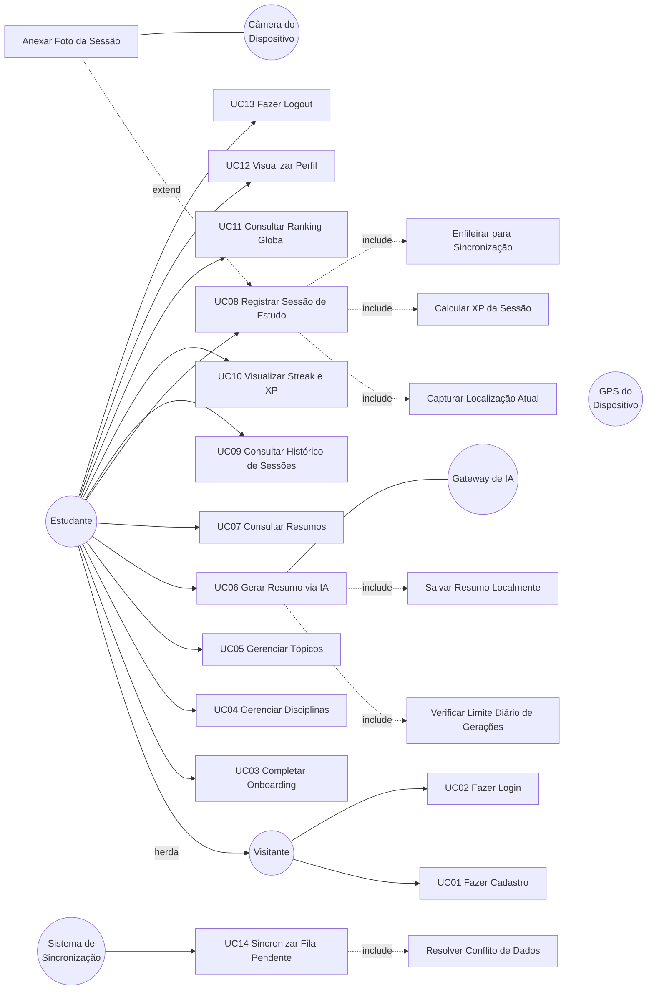

# Estudo 03 — Diagrama de Casos de Uso (UML) — StudyRats

> **Prompt de origem:** `criacoes/10-prompts-engenharia-software.md` → Prompt 03
> **Projeto:** StudyRats · **Equipe:** Maria Clara Miguel, Sthefany Bueno · **Data:** 17 de Setembro de 2026

---

## 1. Diagrama de Casos de Uso (Mermaid)



---

## 2. Notação Textual Alternativa

```
Ator: Visitante (ator primário humano, não autenticado)
Ator: Estudante (herda de Visitante, autenticado)
Ator: Sistema de Sincronização (ator de tempo/background)
Ator: Gateway de IA (sistema externo — API de LLM)
Ator: Câmera do Dispositivo (hardware externo)
Ator: GPS do Dispositivo (hardware externo)

UC01 Fazer Cadastro (Visitante)
UC02 Fazer Login (Visitante)
UC03 Completar Onboarding (Estudante)
UC04 Gerenciar Disciplinas (Estudante)
UC05 Gerenciar Tópicos (Estudante)
UC06 Gerar Resumo via IA (Estudante, Gateway de IA)
  <<include>> UC06a Verificar Limite Diário de Gerações
  <<include>> UC06b Salvar Resumo Localmente
UC07 Consultar Resumos (Estudante)
UC08 Registrar Sessão de Estudo (Estudante, GPS)
  <<include>> UC08a Capturar Localização Atual
  <<include>> UC08b Calcular XP da Sessão
  <<include>> UC08c Enfileirar para Sincronização
  <<extend>> UC08d Anexar Foto da Sessão (ponto de extensão: permissão de câmera concedida e usuário opta)
UC09 Consultar Histórico de Sessões (Estudante)
UC10 Visualizar Streak e XP (Estudante)
UC11 Consultar Ranking Global (Estudante)
UC12 Visualizar Perfil (Estudante)
UC13 Fazer Logout (Estudante)
UC14 Sincronizar Fila Pendente (Sistema de Sincronização)
  <<include>> UC14a Resolver Conflito de Dados
```

---

## 3. Descrição Textual dos Casos de Uso Críticos

### UC01 — Fazer Cadastro

| Campo | Descrição |
|-------|-----------|
| **Ator(es)** | Visitante |
| **Pré-condição** | Usuário não autenticado; há conexão com a internet |
| **Fluxo Principal** | 1. Visitante acessa tela de cadastro · 2. Informa email, senha e nome de exibição · 3. Sistema envia dados para Supabase Auth · 4. Supabase cria conta e retorna token · 5. Sistema persiste token em `expo-secure-store` · 6. Sistema cria registro na tabela `profiles` · 7. Redireciona para UC03 (Onboarding) |
| **Fluxo Alternativo — Sem Rede** | Exibe "Conecte-se à internet para criar sua conta". Cadastro indisponível offline |
| **Fluxo Alternativo — Email já cadastrado** | Supabase retorna erro; exibe "Este email já está em uso" |
| **Fluxo Alternativo — Senha fraca** | Supabase rejeita; exibe critérios de senha |
| **Pós-condição** | Usuário cadastrado no Supabase Auth; conta criada em `profiles`; sessão iniciada localmente |

### UC06 — Gerar Resumo via IA

| Campo | Descrição |
|-------|-----------|
| **Ator(es)** | Estudante; Gateway de IA |
| **Pré-condição** | Estudante autenticado; ≥1 tópico cadastrado; conexão disponível |
| **Fluxo Principal** | 1. Estudante seleciona tópico · 2. Aciona "Gerar Resumo" · 3. Sistema verifica limite diário (include) · 4. Verifica conexão · 5. Envia tópico (nome + disciplina) ao Gateway de IA · 6. Recebe resumo textual · 7. Salva resumo em SQLite (include) · 8. Exibe resumo · 9. Enfileira para sync |
| **Fluxo Alternativo — Sem Rede** | Exibe "Conecte-se à internet para gerar um resumo. Seus resumos anteriores estão disponíveis offline." Botão de geração desabilitado |
| **Fluxo Alternativo — Limite atingido** | Exibe "Você atingiu o limite de 10 resumos hoje. Tente novamente amanhã." (contador reseta à meia-noite local) |
| **Fluxo Alternativo — Erro no Gateway** | Exibe "Não foi possível gerar o resumo. Tente novamente." com opção de retry |
| **Pós-condição** | Resumo gerado e salvo localmente em SQLite; disponível offline |

### UC08 — Registrar Sessão de Estudo

| Campo | Descrição |
|-------|-----------|
| **Ator(es)** | Estudante; GPS do Dispositivo; Câmera do Dispositivo |
| **Pré-condição** | Estudante autenticado; ≥1 disciplina e ≥1 tópico cadastrados |
| **Fluxo Principal** | 1. Estudante acessa tela de registro · 2. Seleciona disciplina e tópico · 3. Informa duração (min) · 4. Sistema solicita permissão de localização (se necessário) · 5. Captura coordenadas (include) · 6. Estudante opta por anexar foto (extend) · 7. Cria `SessaoEstudo` com UUID · 8. Salva em SQLite (`pending`) · 9. Calcula XP (include) · 10. Atualiza streak · 11. Enfileira na `sync_queue` (include) · 12. Feedback: "Sessão registrada ✓ +10 XP" |
| **Fluxo Alternativo — Permissão de localização negada** | Sessão registrada sem coordenadas (lat/lng = null). Aviso: "Sessão salva sem localização. Ative o GPS nas configurações..." |
| **Fluxo Alternativo — GPS indisponível (timeout)** | Mesmo tratamento de permissão negada; sessão não é bloqueada |
| **Fluxo Alternativo — Permissão de câmera negada** | Sessão registrada sem foto. Aviso: "Sem acesso à câmera. Sessão salva sem foto." |
| **Fluxo Alternativo — Sem Rede (offline)** | Sessão registrada normalmente; enfileirada; upload da foto quando houver rede. Feedback: "Sessão salva localmente ✓ Será sincronizada quando houver internet." |
| **Pós-condição** | Sessão registrada em SQLite com XP calculado; streak atualizado; registro enfileirado para sync |

### UC11 — Consultar Ranking Global

| Campo | Descrição |
|-------|-----------|
| **Ator(es)** | Estudante |
| **Pré-condição** | Estudante autenticado; conexão disponível |
| **Fluxo Principal** | 1. Acessa tela de Ranking · 2. Verifica conexão · 3. Query Supabase: `SELECT nome, xp_semanal FROM profiles ORDER BY xp_semanal DESC LIMIT 50` · 4. Exibe lista (posição, nome, XP) · 5. Destaca posição do estudante atual |
| **Fluxo Alternativo — Sem Rede** | Exibe "Conecte-se à internet para ver o ranking." com retry; pode exibir último ranking cacheado com aviso "Dados de [data]" |
| **Pós-condição** | Top 50 exibidos ordenados por XP semanal |

### UC14 — Sincronizar Fila Pendente

| Campo | Descrição |
|-------|-----------|
| **Ator(es)** | Sistema de Sincronização |
| **Pré-condição** | Existem registros na `sync_queue` com status `pending`; conexão disponível |
| **Fluxo Principal** | 1. NetInfo detecta conexão · 2. Consulta `sync_queue` (ORDER BY created_at) · 3. Para cada item: identifica entidade/operação · envia ao Supabase · confirmação 2xx · marca `synced` · remove da fila · 4. Se há fotos `upload_status = pending`: comprime (≤800px, 70%) · upload para Storage · atualiza `url_remota` · 5. Atualiza `xp_semanal` no Supabase |
| **Fluxo Alternativo — Conflito (409)** | Aplica last-write-wins por `updated_at` (include Resolver Conflito) |
| **Fluxo Alternativo — Falha de rede** | Incrementa `tentativas`; reagenda com backoff exponencial (2^n s, máx 5 min); item permanece na fila |
| **Fluxo Alternativo — Erro de validação do servidor** | Item marcado como `error`; não bloqueia demais itens |
| **Fluxo Alternativo — Perda de conexão durante processamento** | Para o processamento; retoma ao reconectar; itens confirmados permanecem `synced` |
| **Pós-condição** | Registros sincronizados; itens processados removidos; `sync_status` atualizado |

---

## 4. Tabela de Rastreabilidade UC → RF

| Caso de Uso | RFs cobertos |
|---|---|
| UC01 Fazer Cadastro | RF01 |
| UC02 Fazer Login | RF03 |
| UC03 Completar Onboarding | RF02 |
| UC04 Gerenciar Disciplinas | RF05 |
| UC05 Gerenciar Tópicos | RF06 |
| UC06 Gerar Resumo via IA | RF07, RF08, RF09 |
| UC07 Consultar Resumos | RF10 |
| UC08 Registrar Sessão de Estudo | RF11, RF12, RF13, RF14, RF15, RF19 |
| UC09 Consultar Histórico de Sessões | RF21 |
| UC10 Visualizar Streak e XP | RF14 |
| UC11 Consultar Ranking Global | RF16 |
| UC12 Visualizar Perfil | RF18 |
| UC13 Fazer Logout | RF04 |
| UC14 Sincronizar Fila Pendente | RF19, RF20 |