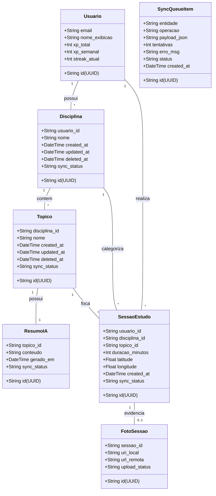

# Estudo 04 — Diagrama de Classes e Persistência — StudyRats

> **Prompt de origem:** `criacoes/10-prompts-engenharia-software.md` → Prompt 04
> **Projeto:** StudyRats · **Equipe:** Maria Clara Miguel, Sthefany Bueno · **Data:** 17 de Setembro de 2026

---

## 1. Diagrama de Classes (Mermaid)

Entidades do domínio com atributos de controle de sincronização (offline-first): `id` UUID gerado no cliente, `updated_at` (last-write-wins), `deleted_at` (soft delete) e `sync_status`.

---

## 2. Tabela de Persistência

| Classe | Local (SQLite) | Remota (Supabase) | Estratégia | Observação |
|--------|---------------|------------------|-----------|-----------|
| Usuario | Sim (cache de sessão) | Sim (`auth.users` + `profiles`) | Fonte da verdade: Supabase Auth; cache local para sessão offline | Token em `expo-secure-store` |
| Disciplina | Sim (`disciplinas`) | Sim (`disciplinas`) | Fonte da verdade: local até sync, depois remota; `updated_at` decide conflito | Soft delete |
| Topico | Sim (`topicos`) | Sim (`topicos`) | Idem Disciplina | Soft delete |
| ResumoIA | Sim (`resumos_ia`) | Sim (`resumos_ia`) | Gerado online, salvo localmente após geração | Disponibilidade offline |
| SessaoEstudo | Sim (`sessoes_estudo`) | Sim (`sessoes_estudo`) | Idem Disciplina | — |
| FotoSessao | Sim (arquivo local + `fotos_sessao`) | Sim (Supabase Storage + `fotos_sessao`) | Upload de binário assíncrono, separado do sync tabular | `uri_local` + `url_remota` |
| SyncQueueItem | Sim (`sync_queue`) | Não | Efêmera, só local, apagada após sync confirmado | Outbox pattern |

---

## 3. Tabela de Mapeamento DDD

| Aggregate Root | Entidades Internas | Value Objects | Repository (interface) | Gateways |
|----------------|-------------------|---------------|----------------------|----------|
| SessaoEstudo | FotoSessao | Coordenada, StatusSincronizacao | SessaoRepository | CameraGateway, LocationGateway, SyncGateway |
| Disciplina | Topico, ResumoIA | StatusSincronizacao | DisciplinaRepository, TopicoRepository | — |
| Usuario | — | Email | UsuarioRepository (cache local) | AuthGateway |

> **Invariante de agregado:** `FotoSessao` só é acessada através de sua raiz `SessaoEstudo` — nunca referenciar via repository próprio.

---

## 4. Glossário de Linguagem Ubíqua

| Termo | Definição |
|-------|-----------|
| **Estudante** | Usuário autenticado do app; dono das disciplinas, tópicos, sessões, XP e streak |
| **Disciplina** | Matéria cadastrada pelo estudante (ex.: Matemática); raiz do agregado que contém Tópicos |
| **Tópico** | Assunto específico dentro de uma Disciplina (ex.: Derivadas); base para geração de resumos via IA |
| **Resumo** | Material de revisão gerado pela IA a partir de um tópico; persistido localmente e disponível offline |
| **Sessão de Estudo** | Registro de estudo realizado: disciplina + tópico + duração (+ foto + coordenadas); gera XP |
| **Foto de Sessão** | Evidência visual (caderno/material) capturada pela câmera e vinculada à sessão |
| **Streak** | Sequência de dias consecutivos com pelo menos 1 sessão concluída |
| **XP** | Pontuação: +10 por sessão; +50 bônus a cada streak de 7 dias |
| **Ranking** | Leaderboard global semanal (Top 50) ordenado por XP semanal |
| **Sincronização** | Processo (outbox) que envia dados locais pendentes ao Supabase quando há rede |