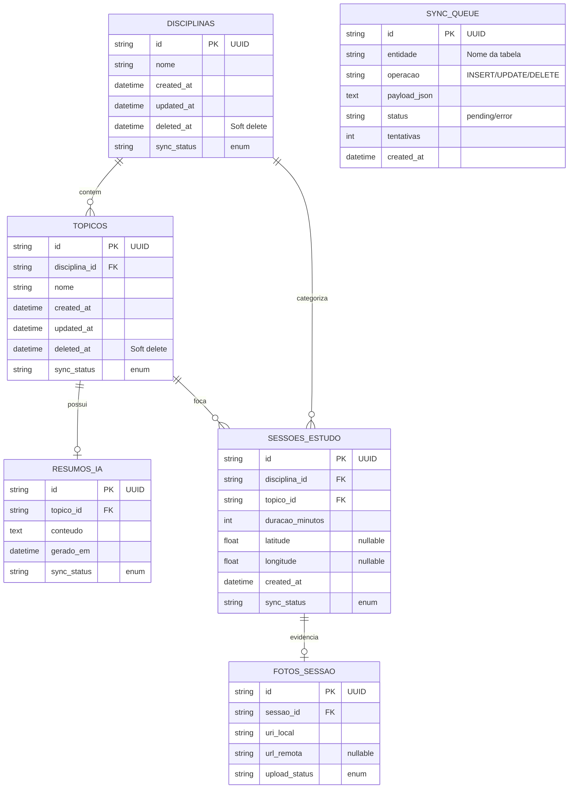
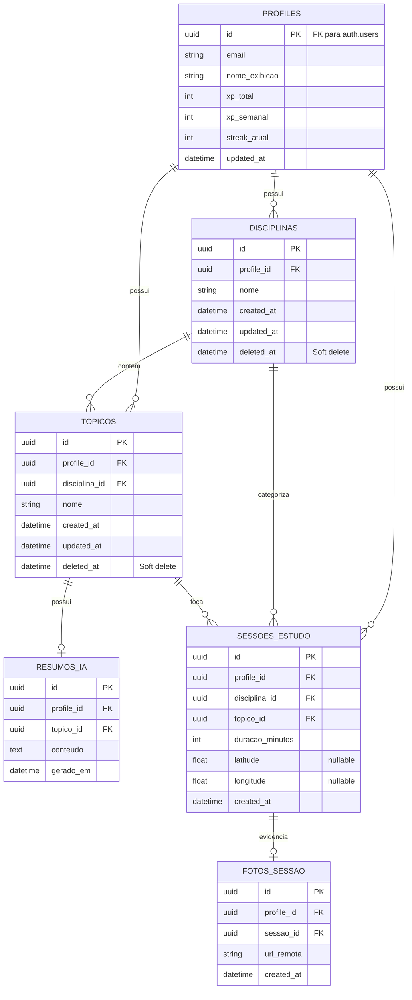

# Estudo 05 — Modelo Entidade-Relacionamento (Local/Remoto) e Políticas RLS — StudyRats

> **Prompt de origem:** `criacoes/10-prompts-engenharia-software.md` → Prompt 05
> **Projeto:** StudyRats · **Equipe:** Maria Clara Miguel, Sthefany Bueno · **Data:** 17 de Setembro de 2026

**Estratégia de sync:** Outbox pattern + NetInfo listener · **Conflito:** last-write-wins por `updated_at` · **Mídia:** upload assíncrono para Supabase Storage.

---

## 1. DER Local (SQLite)

Banco local = fonte da verdade offline. Inclui `SYNC_QUEUE` (efêmera, outbox). Tipos SQLite (`string`, `int`, `real`, `datetime`).

---

## 2. DER Remoto (Supabase/Postgres)

Sem `SYNC_QUEUE` (exclusiva do ambiente local). Tabela `PROFILES` com FK para `auth.users(id)`. **Todas** as tabelas filhas possuem `profile_id FK` para aplicar RLS. Tipos Postgres (`uuid`, `text`, `timestamptz`, `double precision`, `int`).

---

## 3. Tabela de Políticas RLS

| Tabela | Operação | Policy Name | Expressão | Observação |
|--------|----------|-------------|-----------|-----------|
| profiles | ALL | own_profile | `id = auth.uid()` | Usuário só acessa seu próprio perfil |
| disciplinas | ALL | own_disciplinas | `profile_id = auth.uid()` | RLS por FK de dono |
| topicos | ALL | own_topicos | `profile_id = auth.uid()` | RLS por FK de dono |
| resumos_ia | ALL | own_resumos | `profile_id = auth.uid()` | RLS por FK de dono |
| sessoes_estudo | ALL | own_sessoes | `profile_id = auth.uid()` | RLS por FK de dono |
| fotos_sessao | ALL | own_fotos | `profile_id = auth.uid()` | RLS por FK de dono |

> **Dica:** criar os policies após `enable row level security` em cada tabela. `ALL` = `USING` + `WITH CHECK` com a mesma expressão.

---

## 4. Tabela de Upload de Mídia

| Entidade | Campo Local | Campo Remoto | Bucket Supabase | Policy de Storage |
|----------|-----------|-------------|----------------|-----------------|
| FotoSessao | `uri_local` (filesystem) | `url_remota` / `storage_path` | `sessao-fotos` | Usuário só acessa arquivos em `{auth.uid()}/` |

**Pipeline:** captura → salva local (`upload_status = pending`) → comprime (≤800px, qualidade 70%, ≤500KB) → upload assíncrono → preenche `url_remota` → `upload_status = synced`.

---

## 5. Checklist de Consistência

- [x] Cardinalidade Local ↔ Remoto idênticas (DISCIPLINAS 1-N TOPICOS, 1-N SESSOES; TOPICOS 1-N SESSOES, 0..1 RESUMOS; SESSOES 0..1 FOTOS)
- [x] Diagrama de Classes ↔ DER: multiplicidades idênticas (Usuario 1-*, Disciplina 1-*, Topico 1-*, SessaoEstudo 0..1 Foto)
- [x] `SYNC_QUEUE` presente **apenas** no schema local
- [x] `profile_id FK` presente em todas as tabelas filhas remotas (base do RLS)
- [x] `Profiles.id` espelha `auth.users.id` (1:1)
- [x] Soft delete (`deleted_at`) espelhado nas tabelas sincronizáveis dos dois schemas
- [x] Value Objects como colunas embutidas (latitude/longitude, sync_status, upload_status) — sem tabelas separadas