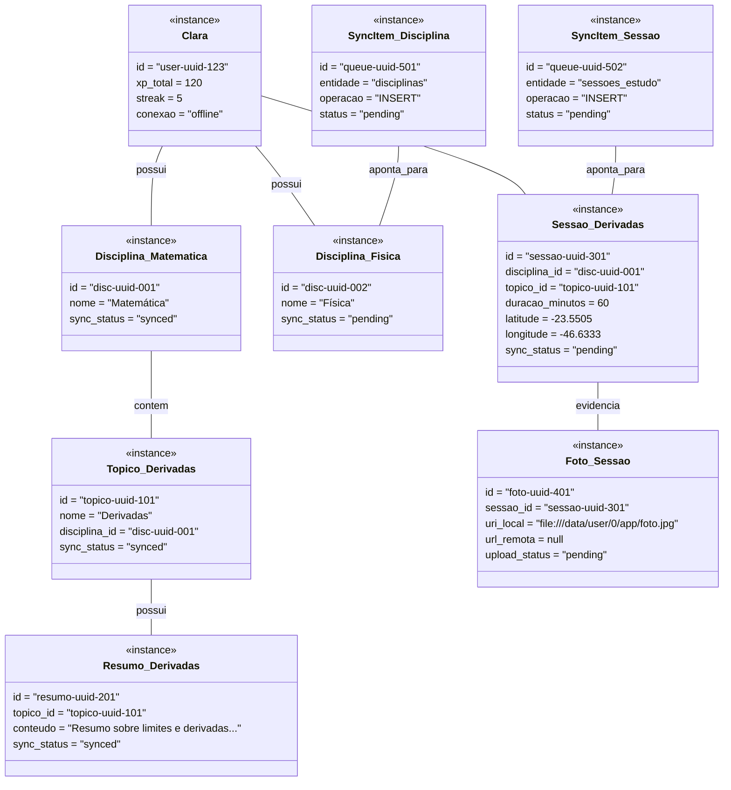
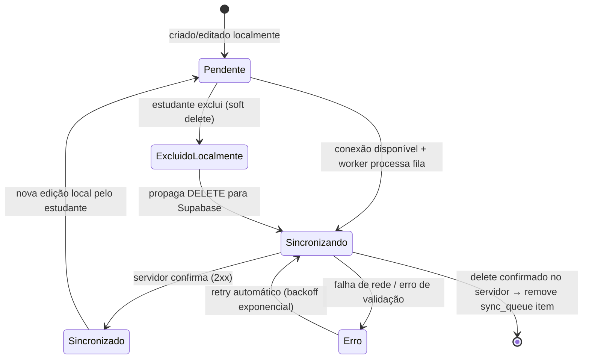
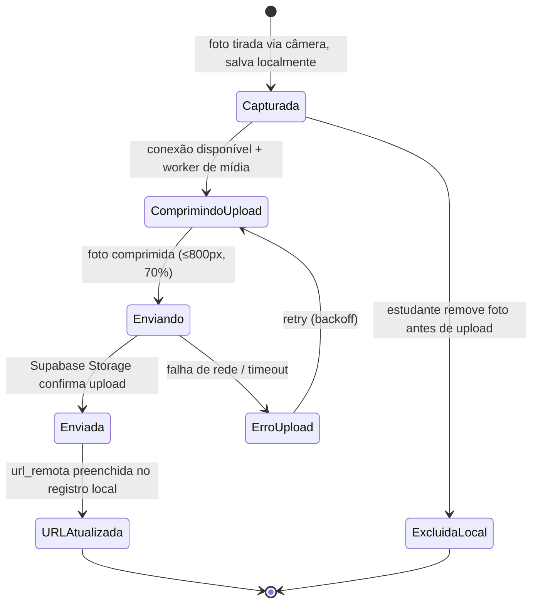

# Estudo 06 — Diagrama de Objetos e Diagramas de Estado — StudyRats

> **Prompt de origem:** `criacoes/10-prompts-engenharia-software.md` → Prompt 06
> **Projeto:** StudyRats · **Equipe:** Maria Clara Miguel, Sthefany Bueno · **Data:** 17 de Setembro de 2026

---

## 1. Diagrama de Objetos (Cenário de Sincronização Parcial)

**Cenário:** A estudante Clara está offline. Tem a disciplina "Matemática" (synced) com o tópico "Derivadas" (synced) e um resumo gerado anteriormente (synced). Acabou de criar a disciplina "Física" (pending) e registrou uma sessão de 60min sobre "Derivadas" com foto e GPS. A sessão (pending) tem foto (pending, sem `url_remota`). Há 2 itens na `SyncQueue`. XP total 120, streak 5 dias.

**Validações do cenário:**
- **Estado misto**: entidades `synced` (Matemática, Derivadas, Resumo) coexistem com `pending` (Física, Sessão, Foto) — corpus clássico de teste do sync engine.
- **Multiplicidades**: Disciplina 1-N Tópicos; SessaoEstudo 0..1 FotoSessao; Topico 0..1 ResumoIA.

---

## 2. Diagrama de Estados — Ciclo de Sincronização

Aplica-se às entidades sincronizáveis `Disciplina`, `Topico`, `ResumoIA`, `SessaoEstudo` (atributo `sync_status`).

---

## 3. Diagrama de Estados — Upload de Foto

Aplica-se a `FotoSessao` (atributo `upload_status`). Upload é separado do sync de dados tabulares.

---

## 4. Tabela de Correlação

| Entidade | Atributo | Diagrama | Valores |
|----------|---------|----------|---------|
| Disciplina, Topico, ResumoIA, SessaoEstudo | `sync_status` | Ciclo de Sincronização | `pending`, `synced`, `error` |
| FotoSessao | `upload_status` | Ciclo de Upload | `pending`, `uploading`, `synced`, `error` |

---

## 5. Registro de Avaliação

> **Avaliado** — nenhuma entidade possui ciclo de vida de negócio adicional além do ciclo de sincronização (não há entidade com status de negócio tipo "Aberto→Pago→Enviado"). O único ciclo modelado é o de sincronização/upload. Na implementação (Fase 4), a máquina de estados vira validação dentro da entidade de domínio e do service de sincronização — nunca troca de status "solta".