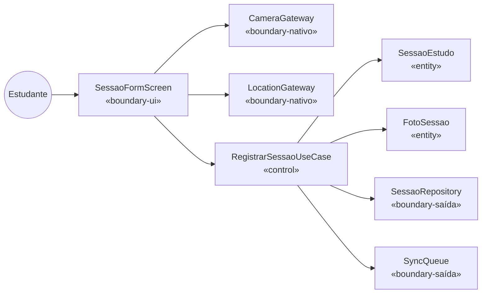
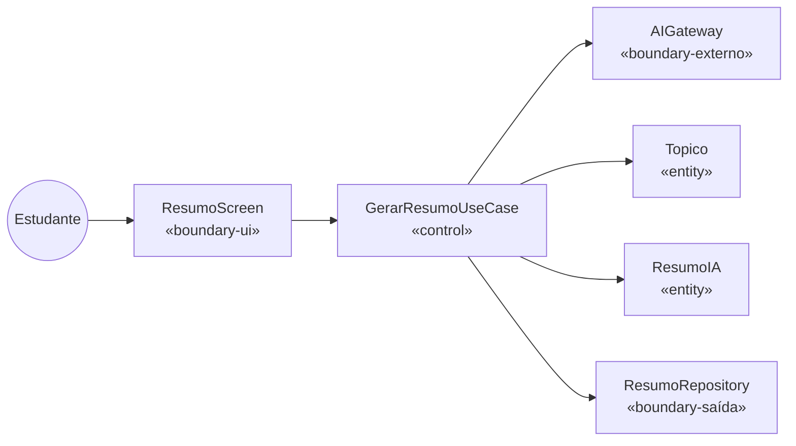
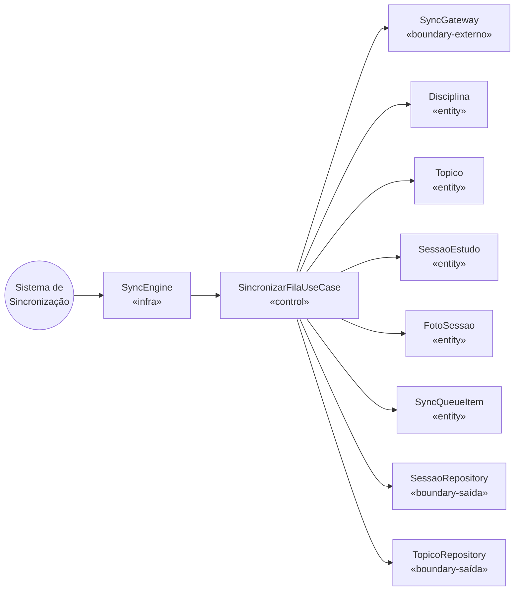

# Estudo 07 — Modelagem Boundary-Control-Entity (BCE) — StudyRats

> **Prompt de origem:** `criacoes/10-prompts-engenharia-software.md` → Prompt 07
> **Projeto:** StudyRats · **Equipe:** Maria Clara Miguel, Sthefany Bueno · **Data:** 17 de Setembro de 2026

---

## 1. Tabela de Mapeamento BCE por Caso de Uso (14 UCs)

| Caso de Uso | Boundary (UI) | Boundary (nativo/externo) | Control | Entities |
|-------------|--------------|--------------------------|---------|---------|
| UC01 Fazer Cadastro | `CadastroScreen` | `AuthGateway` | `AutenticarUsuarioUseCase` | `Usuario` |
| UC02 Fazer Login | `LoginScreen` | `AuthGateway` | `AutenticarUsuarioUseCase` | `Usuario` |
| UC03 Completar Onboarding | `OnboardingScreen` | — | — | — |
| UC04 Gerenciar Disciplinas | `DisciplinaFormScreen` | — | `CadastrarDisciplinaUseCase` | `Disciplina` |
| UC05 Gerenciar Tópicos | `TopicoFormScreen` | — | `CadastrarTopicoUseCase` | `Topico` |
| UC06 Gerar Resumo via IA | `ResumoScreen` | `AIGateway` | `GerarResumoUseCase` | `Topico`, `ResumoIA` |
| UC07 Consultar Resumos | `ResumoScreen` | — | — | `ResumoIA` |
| UC08 Registrar Sessão | `SessaoFormScreen` | `CameraGateway`, `LocationGateway` | `RegistrarSessaoUseCase` | `SessaoEstudo`, `FotoSessao` |
| UC09 Consultar Histórico | `HistoricoSessoesScreen` | — | — | `SessaoEstudo`, `FotoSessao` |
| UC10 Visualizar Streak e XP | `StreakXPScreen` | — | — | `Usuario` |
| UC11 Consultar Ranking | `RankingScreen` | `SyncGateway` | `ConsultarRankingUseCase` | `Usuario` |
| UC12 Visualizar Perfil | `PerfilScreen` | — | — | `Usuario` |
| UC13 Fazer Logout | `PerfilScreen` | `AuthGateway` | `AutenticarUsuarioUseCase` | `Usuario` |
| UC14 Sincronizar Fila | *(background)* | `SyncGateway` | `SincronizarFilaUseCase` | `Disciplina`, `Topico`, `SessaoEstudo`, `FotoSessao`, `SyncQueueItem` |

---

## 2. Diagramas de Robustez (3 UCs críticos)

### UC08 — Registrar Sessão de Estudo

### UC06 — Gerar Resumo via IA

### UC14 — Sincronizar Fila Pendente

---

## 3. Lista por Estereótipo

**Boundary (UI — 11 telas):** `LoginScreen`, `CadastroScreen`, `OnboardingScreen`, `DisciplinaFormScreen`, `TopicoFormScreen`, `ResumoScreen`, `SessaoFormScreen`, `HistoricoSessoesScreen`, `StreakXPScreen`, `RankingScreen`, `PerfilScreen`

**Boundary (Nativo/Externo — 5 gateways):** `CameraGateway`, `LocationGateway`, `AuthGateway`, `SyncGateway`, `AIGateway`

**Control (7 use cases):** `AutenticarUsuarioUseCase`, `CadastrarDisciplinaUseCase`, `CadastrarTopicoUseCase`, `GerarResumoUseCase`, `RegistrarSessaoUseCase`, `ConsultarRankingUseCase`, `SincronizarFilaUseCase`

**Entity (7):** `Usuario`, `Disciplina`, `Topico`, `ResumoIA`, `SessaoEstudo`, `FotoSessao`, `SyncQueueItem`

> **Regras aplicadas:** Boundary NUNCA acessa Entity diretamente — sempre via Control. Control NUNCA importa SDK nativo — só interfaces de Gateway/Repository definidas no domínio.

---

## 4. Tabela de Transição BCE → Clean Architecture

| Estereótipo | Camada | Diretório |
|-------------|--------|----------|
| Boundary (UI) | adapters/screens | `src/adapters/screens/` |
| Boundary (Gateway) | adapters/gateways + domain/gateways (interface) | `src/adapters/gateways/` + `src/domain/gateways/` |
| Control | application/use-cases | `src/application/use-cases/` |
| Entity | domain/entities | `src/domain/entities/` |