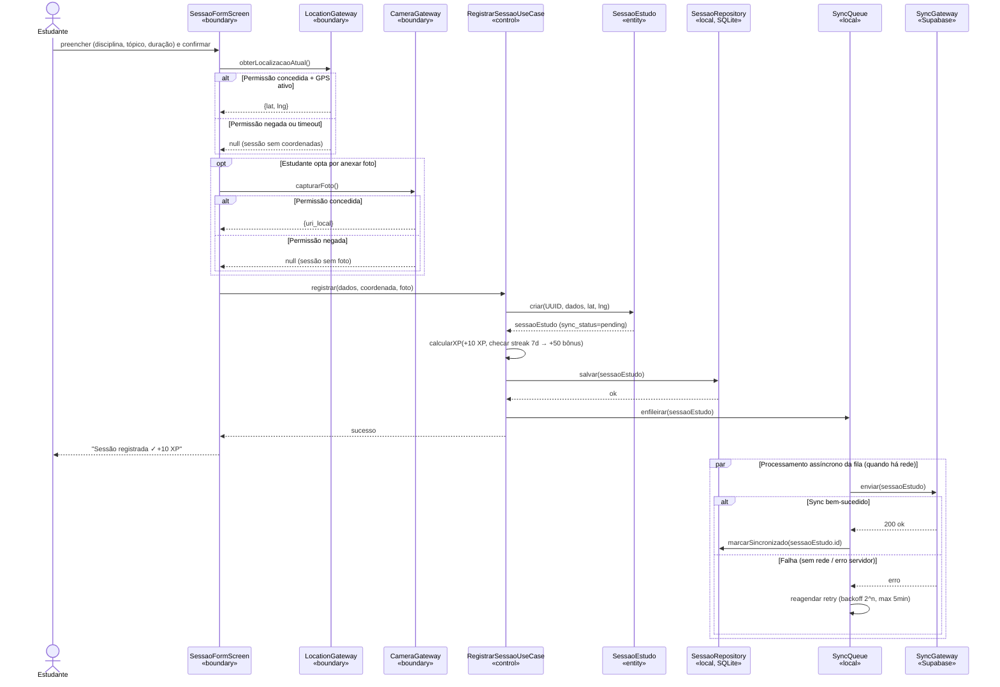
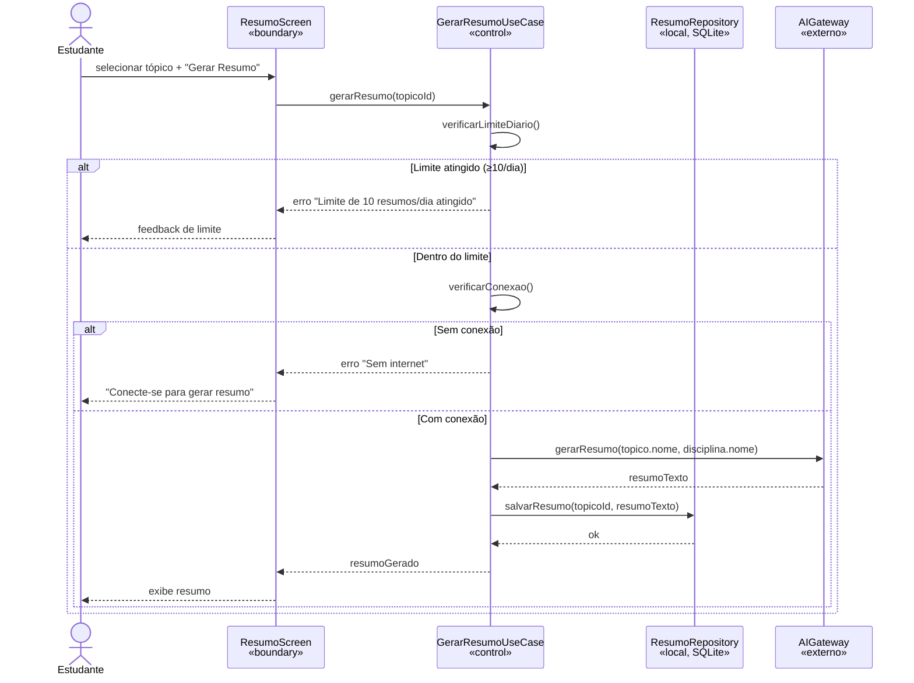
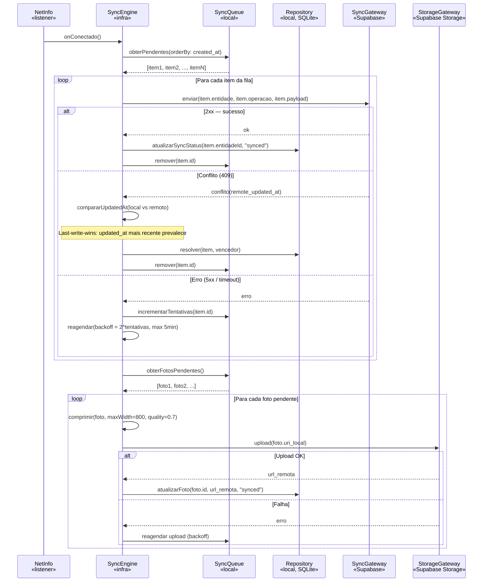

# Estudo 08 — Diagramas de Sequência — StudyRats

> **Prompt de origem:** `criacoes/10-prompts-engenharia-software.md` → Prompt 08
> **Projeto:** StudyRats · **Equipe:** Maria Clara Miguel, Sthefany Bueno · **Data:** 17 de Setembro de 2026

---

## Fluxo 1 — UC08 Registrar Sessão de Estudo (fluxo offline/online)

---

## Fluxo 2 — UC06 Gerar Resumo via IA

---

## Fluxo 3 — UC14 Sincronizar Fila Pendente

---

## Tabela de Rastreabilidade

| Diagrama | UC | RFs cobertos | Fluxos modelados |
|----------|-----|-------------|-----------------|
| Fluxo 1 | UC08 | RF11, RF12, RF13, RF14, RF15, RF19 | Principal + Permissão negada + Offline |
| Fluxo 2 | UC06 | RF07, RF08, RF09, RF10 | Principal + Limite atingido + Sem rede |
| Fluxo 3 | UC14 | RF19, RF20 | Loop de processamento + Conflito + Retry + Upload de fotos |

> **Nota de conformidade:** todo diagrama de escrita mostra os dois momentos do offline-first — (1) gravação local imediata (síncrona, sempre bem-sucedida para o usuário) e (2) sync remota assíncrona em `par`. Nomes dos participantes derivam da tabela BCE (Estudo 07).