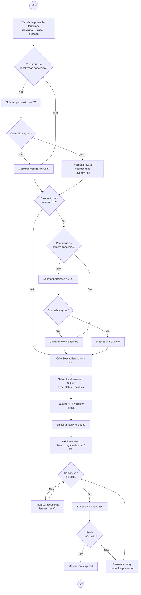
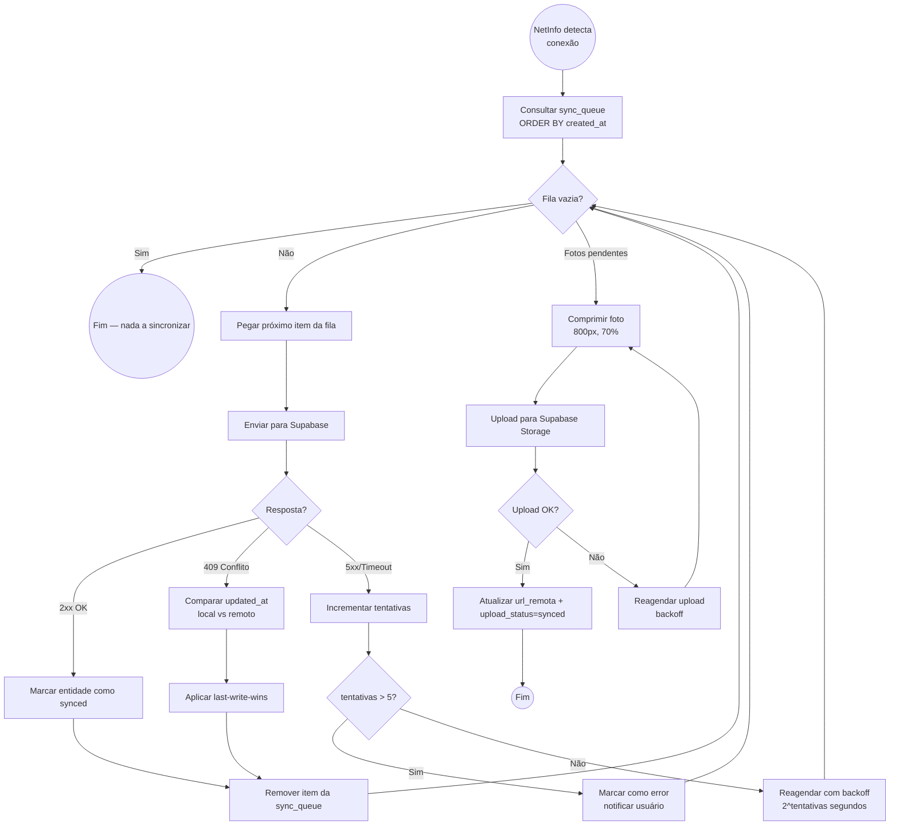

# Estudo 09 — Diagramas de Atividades — StudyRats

> **Prompt de origem:** `criacoes/10-prompts-engenharia-software.md` → Prompt 09
> **Projeto:** StudyRats · **Equipe:** Maria Clara Miguel, Sthefany Bueno · **Data:** 17 de Setembro de 2026

---

## Atividade 1 — UC08 Registrar Sessão de Estudo (decisões de permissão + conectividade)

### Raias (descrição textual)

- **Raia Estudante:** preenche o formulário (disciplina + tópico + duração), opta por anexar foto e recebe o feedback final.
- **Raia Sistema:** solicita permissões ao SO, captura GPS/foto, cria a `SessaoEstudo`, salva em SQLite, calcula XP/streak, enfileira e sincroniza com Supabase.

---

## Atividade 2 — Processo de Sincronização Ponta-a-Ponta (Sync Engine)

### Raias (descrição textual)

- **Raia SyncEngine:** detecta conectividade, lê a `sync_queue`, processa dados (com retry/backoff e resolução de conflito) e depois processa fotos pendentes (compressão + agendamento de upload).
- **Raia Supabase:** recebe e confirma as requisições de dados (REST) e de mídia (Storage).

---

## Tabela de Rastreabilidade

| Diagrama | UC | Decisões modeladas |
|----------|-----|-------------------|
| Atividade 1 | UC08 | Permissão GPS, Permissão Câmera, Conectividade, Confirmação sync |
| Atividade 2 | UC14 | Fila vazia, Resposta servidor (2xx/409/5xx), Max tentativas, Upload OK |

> Os fluxos são 1:1 com os diagramas de sequência do Estudo 08 (mesmos gateways: `CameraGateway`, `LocationGateway`, `SyncGateway`, `SyncQueue`, `StorageGateway`).