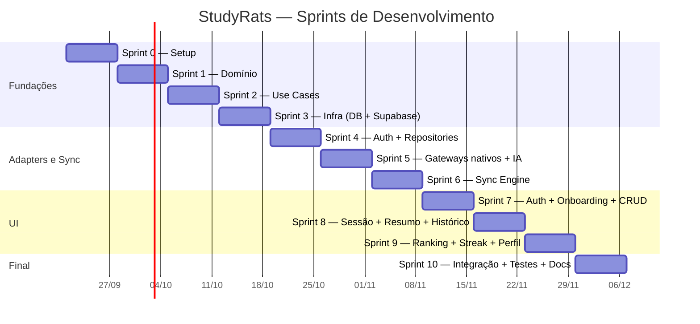

# Estudo 10 — Documentação de Arquitetura de Implementação (DDD + Clean Architecture + TDD) e Cronograma — StudyRats

> **Prompt de origem:** `criacoes/10-prompts-engenharia-software.md` → Prompt 10
> **Projeto:** StudyRats · **Equipe:** Maria Clara Miguel, Sthefany Bueno · **Data:** 17 de Setembro de 2026
> **Prazo:** ~60 horas-aula (2 devs, ≈10 semanas de ~6h) · **Sprint:** 1 semana (~6h)

---

## 1. Mapeamento DDD Completo

| Aggregate Root | Entidades Internas | Value Objects | Repository | Gateways envolvidos | Domain Services |
|----------------|--------------------|---------------|-----------|---------------------|-----------------|
| Usuario | — | Email | UsuarioRepository (cache local) | AuthGateway | — |
| Disciplina | — | StatusSincronizacao | DisciplinaRepository | — | — |
| Topico | ResumoIA | StatusSincronizacao | TopicoRepository | AIGateway (na geração de resumo) | — |
| SessaoEstudo | FotoSessao | Coordenada, StatusSincronizacao | SessaoRepository | CameraGateway, LocationGateway, SyncGateway | — |

**Domain Service dedicado:** `SincronizacaoService` — resolve conflito de `updated_at` entre agregados (last-write-wins) durante o sync.

**Regras DDD:**
1. Entidade = objeto puro, **sem** import de SDK nativo, ORM ou Supabase.
2. Value Object imutável e com validação interna — ex.: `Coordenada(-100, 200)` **deve lançar erro**.
3. 1 Repository por Aggregate Root: `SessaoRepository` (SessaoEstudo + FotoSessao), `DisciplinaRepository`, `TopicoRepository` (Topico + ResumoIA), `UsuarioRepository` (cache).
4. Gateway = interface no domínio, implementação no adapter.
5. Nomes com linguagem ubíqua do domínio — proibido `Manager`, `Helper`, `Processor` genéricos.

---

## 2. Estrutura de Diretórios (Clean Architecture)

```
src/
  domain/
    entities/          ← Usuario.ts, Disciplina.ts, Topico.ts, ResumoIA.ts, SessaoEstudo.ts, FotoSessao.ts
    value-objects/     ← Coordenada.ts, StatusSincronizacao.ts, Email.ts
    repositories/      ← SessaoRepository.ts, DisciplinaRepository.ts, TopicoRepository.ts, UsuarioRepository.ts (interfaces)
    gateways/          ← CameraGateway.ts, LocationGateway.ts, AuthGateway.ts, SyncGateway.ts, AIGateway.ts (interfaces)
    services/          ← SincronizacaoService.ts (interface)
  application/
    use-cases/         ← AutenticarUsuarioUseCase.ts, CadastrarDisciplinaUseCase.ts, CadastrarTopicoUseCase.ts,
                         GerarResumoUseCase.ts, RegistrarSessaoUseCase.ts, ConsultarRankingUseCase.ts, SincronizarFilaUseCase.ts
  adapters/
    screens/           ← 11 telas Expo Router (Login, Cadastro, Onboarding, DisciplinaForm, TopicoForm,
                         Resumo, SessaoForm, HistoricoSessoes, StreakXP, Ranking, Perfil)
    hooks/             ← hooks de apresentação (useTopicos, useSessoes, useAuth) — adaptam use cases ao ciclo React
    repositories/      ← TopicoRepositorySQLite.ts, SessaoRepositorySQLite.ts, DisciplinaRepositorySQLite.ts
    gateways/
      camera/          ← CameraGatewayExpo.ts        (expo-camera / expo-image-picker)
      location/        ← LocationGatewayExpo.ts      (expo-location foreground)
      auth/            ← AuthGatewaySupabase.ts      (supabase-js Auth + expo-secure-store)
      sync/            ← SyncGatewaySupabase.ts      (supabase-js + Storage)
      ai/              ← AIGatewayLLM.ts             (HTTP p/ Supabase Edge Function → Gemini)
  infra/
    db/
      schema.ts        ← schema Drizzle (tabelas SQLite: disciplinas, topicos, resumos_ia, sessoes_estudo, fotos_sessao, sync_queue)
      client.ts        ← setup expo-sqlite + drizzle
      migrations/
    supabase/
      client.ts        ← setup supabase-js (URL + anon key), doc de RLS
    sync/
      sync-engine.ts   ← loop de processamento da sync_queue + NetInfo + retry/backoff (2^n s, máx 5 min, máx 5 tentativas)
    ai/
      edge-function.ts ← (Supabase Edge Function) proxy Gemini — guarda a API key no servidor
```

> **Regra de checagem (automática via lint/CI):** se um arquivo em `domain/` ou `application/` importar `expo-camera`, `expo-location`, `expo-sqlite`, `drizzle-orm` ou `@supabase/supabase-js` → violação arquitetural. Mover a chamada para o adapter correspondente e expor apenas a interface.

---

## 3. Plano de Testes TDD (Pirâmide)

| Camada | Quantidade relativa | Técnica | Exemplos no StudyRats |
|--------|--------------------|---------|----------------------|
| **1. Domínio** | Muitos | Teste de unidade puro (sem mocks) | `Coordenada(-100, 200)` lança erro; `SessaoEstudo.calcularXP()` = 10; streak 7d retorna +50 bônus; `Email` rejeita formato inválido; invariante do agregado |
| **2. Use Case** | Muitos | Fakes in-memory de repositórios/gateways | `RegistrarSessaoUseCase`: caminho feliz, permissão de localização negada, GPS indisponível, camera negada, offline → enfileira; `GerarResumoUseCase`: limite atingido, sem rede |
| **3. Gateway/Adapter** | Médios | `jest.mock('expo-location')`, `jest.mock('expo-camera')`, mock de supabase-js | `LocationGatewayExpo` traduz corretamente a API nativa e o erro de permissão; `AIGatewayLLM` serializa request p/ Edge Function; `AuthGatewaySupabase` persiste sessão em SecureStore |
| **4. Repository (SQLite real)** | Médios | Drizzle contra SQLite in-memory/arquivo temporário | `SessaoRepositorySQLite`: mapeamento ORM, migrations, soft delete, `obterPendentes()` |
| **5. Sync Engine** | Médios | Fila real + `SyncGateway` mockado (ou supabase local) | Retry/backoff, conflito 409 → last-write-wins, max 5 tentativas → `error`, upload de foto + `url_remota` |
| **6. Componente/Tela** | Poucos | `@testing-library/react-native` + use case fake | `SessaoFormScreen`: interação, estados loading/erro/permissão, feedback "Salvo localmente ✓" |
| **7. E2E (opcional)** | Pouquíssimos | Maestro contra dev build | Login → registrar sessão offline → reconectar → confirmar sync |

**Rastreabilidade:** cada RF (RF01–RF21) deve ter ≥1 teste de aceitação; cada RNF de offline/sync deve ter teste com `NetInfo` mockado retornando `isConnected: false`.

---

## 4. Cronograma de Sprints

| Sprint | Duração | Objetivo | Entregáveis | Critério de Aceitação | Horas est. |
|---|---|---|---|---|---|
| **Sprint 0** | 1 sem (~6h) | Setup do monorepo | Projeto Expo (SDK 57), Supabase projetado (tabelas + RLS + bucket), Drizzle configurado, CI + lint (eslint + regra de arquitetura) | `npx expo start` roda; políticas RLS ativas; pipeline CI executa lint/test em cada PR | 6h |
| **Sprint 1** | 1 sem (~6h) | Domínio puro | Entidades (6), VOs (3), interfaces de repositórios (4) e gateways (5), `SincronizacaoService` | Todos os testes de domínio verdes (ex.: `Coordenada(-100,200)` lança erro) | 6h |
| **Sprint 2** | 1 sem (~6h) | Application Layer | 7 Use Cases com fakes in-memory | `RegistrarSessaoUseCase` cobre caminho feliz, permissões negadas e offline | 6h |
| **Sprint 3** | 1 sem (~6h) | Infra — banco e Supabase | `infra/db/schema.ts` + migrations; `infra/supabase/client.ts` | Migrations aplicam; CRUD SQLite direto funciona via Drizzle | 6h |
| **Sprint 4** | 1 sem (~6h) | Adapters — Auth + Repositories | `AuthGatewaySupabase`, repos SQLite (Disciplina/Topico/Sessao) | Login/cadastro criam profile; repostitórios persistam via SQLite | 6h |
| **Sprint 5** | 1 sem (~6h) | Adapters — Gateways nativos + IA | `CameraGatewayExpo`, `LocationGatewayExpo`, `AIGatewayLLM` + Edge Function | Captura de foto e GPS traduzidas para a interface do domínio; resumo gerado via Edge Function | 6h |
| **Sprint 6** | 1 sem (~6h) | Sync Engine | `sync-engine.ts` (NetInfo + retry + backoff + conflito + upload de mídia) | Fila de 50 itens sincroniza ≤30s em 4G; conflito 409 resolve por LWW; fotos sobem p/ Storage | 6h |
| **Sprint 7** | 1 sem (~6h) | UI — Auth + Onboarding + CRUD | Login/Cadastro/Onboarding; screens de Disciplina e Tópico | Fluxo completo de onboarding cria usuário; CRUD offline funcional nas telas | 6h |
| **Sprint 8** | 1 sem (~6h) | UI — Sessão + Resumo + Histórico | `SessaoFormScreen` (foto + GPS), `ResumoScreen`, `HistoricoSessoesScreen` | Registrar sessão com foto/GPS offline; gerar e ler resumos; histórico exibe sessões | 6h |
| **Sprint 9** | 1 sem (~6h) | UI — Ranking + Streak + Perfil + Polish | `RankingScreen`, `StreakXPScreen`, `PerfilScreen`, badges de sync (RNF08) | Ranking Top 50 exibido; streak/XP visíveis; indicadores 🟡🟢🔴 de sync em todos os registros | 6h |
| **Sprint 10** | 1 sem (~6h) | Integração, testes finais, docs | Testes de regressão, E2E (Maestro), ajuste de RNF, documentação final | Checklist de rastreabilidade 100% verde; E2E do caminho crítico passa | 6h |

---

## 5. Diagrama de Gantt



---

## 6. Checklist de Rastreabilidade Final

- [ ] Cada RF (RF01–RF21) tem ≥1 teste de aceitação
- [ ] Cada UC (UC01–UC14) aparece na tabela BCE e no diagrama de sequência
- [ ] Cada entity sincronizável tem diagrama de estados (sync + upload)
- [ ] Cada gateway tem interface no domínio e implementação no adapter
- [ ] Nenhum arquivo em `domain/` ou `application/` importa SDK externo (verificação via CI)
- [ ] Cada sprint tem critério de aceitação claro
- [ ] RNFs de offline/sync cobertos por teste com `NetInfo` mockado
- [ ] RLS aplicada e testada em todas as tabelas remotas