# Documento de Especificação de Software — StudyRats

> **Versão:** 1.3 — Fases 1 a 3 (Fundações + Modelagem + Arquitetura)  
> **Data:** 16 de Setembro de 2026  
> **Equipe:** Maria Clara Miguel, Sthefany Bueno  
> **Referência metodológica:** [`mobile-design-doc/SKILL.md`](../projeto2026-SKILLs/mobile-design-doc/SKILL.md)  
> **Proposta conceitual:** [`proposta-produto.md`](proposta-produto.md)

---

## Sumário

- [1. Levantamento de Requisitos](#1-levantamento-de-requisitos)
  - [1.1 Requisitos Funcionais (RF)](#11-requisitos-funcionais-rf)
  - [1.2 Requisitos Não Funcionais (RNF)](#12-requisitos-não-funcionais-rnf)
- [2. Diagrama de Casos de Uso](#2-diagrama-de-casos-de-uso)
  - [2.1 Atores](#21-atores)
  - [2.2 Diagrama (Mermaid)](#22-diagrama-mermaid)
  - [2.3 Descrição Textual dos Casos de Uso Críticos](#23-descrição-textual-dos-casos-de-uso-críticos)
- [3. Modelagem de Dados (Fase 2)](#3-modelagem-de-dados-fase-2)
  - [3.1 Diagrama de Classes (Domínio)](#31-diagrama-de-classes-domínio)
  - [3.2 Modelo Relacional Local (DER SQLite)](#32-modelo-relacional-local-der-sqlite)
  - [3.3 Modelo Relacional Remoto (DER Supabase)](#33-modelo-relacional-remoto-der-supabase)
  - [3.4 Diagrama de Objetos (Cenário de Sincronização Parcial)](#34-diagrama-de-objetos-cenário-de-sincronização-parcial)
- [4. Diagrama de Estados (Fase 3)](#4-diagrama-de-estados-fase-3)
  - [4.1 Ciclo de Sincronização — Entidades de Dados](#41-ciclo-de-sincronização--entidades-de-dados)
  - [4.2 Ciclo de Upload — Foto de Sessão](#42-ciclo-de-upload--foto-de-sessão)
- [5. Classes de Fronteira, Controle e Entidade — BCE (Fase 3)](#5-classes-de-fronteira-controle-e-entidade--bce-fase-3)
  - [5.1 Classificação](#51-classificação)
  - [5.2 Tabela de Mapeamento por Caso de Uso](#52-tabela-de-mapeamento-por-caso-de-uso)
  - [5.3 Diagrama de Robustez — UC08](#53-diagrama-de-robustez--uc08-registrar-sessão-de-estudo)
  - [5.4 Diagrama de Robustez — UC06](#54-diagrama-de-robustez--uc06-gerar-resumo-via-ia)
- [6. Diagrama de Sequência (Fase 3)](#6-diagrama-de-sequência-fase-3)
  - [6.1 UC08 — Registrar Sessão de Estudo](#61-uc08--registrar-sessão-de-estudo-fluxo-offlineonline)
  - [6.2 UC06 — Gerar Resumo via IA](#62-uc06--gerar-resumo-via-ia)
  - [6.3 UC14 — Sincronizar Fila Pendente](#63-uc14--sincronizar-fila-pendente)
- [7. Diagrama de Atividades (Fase 3)](#7-diagrama-de-atividades-fase-3)
  - [7.1 UC08 — Registrar Sessão de Estudo](#71-uc08--registrar-sessão-de-estudo-decisões-de-permissão--conectividade)
  - [7.2 Sync Engine Ponta-a-Ponta](#72-processo-de-sincronização-ponta-a-ponta-sync-engine)
- [8. Diagrama de Componentes (Fase 3)](#8-diagrama-de-componentes-fase-3)

---

## 1. Levantamento de Requisitos

### 1.1 Requisitos Funcionais (RF)

| ID | Descrição | Prioridade | Ator/Origem |
|----|-----------|-----------|-------------|
| **RF01** | App deve permitir cadastro de novo usuário com email, senha e nome de exibição via Supabase Auth | Alta | Visitante |
| **RF02** | App deve exibir fluxo de onboarding de 3 telas após primeiro cadastro (escolher disciplinas, definir meta de estudo, tutorial rápido) | Alta | Estudante |
| **RF03** | App deve permitir login de usuário com email e senha, persistindo sessão localmente | Alta | Visitante |
| **RF04** | App deve permitir logout de usuário autenticado, limpando credenciais seguras | Alta | Estudante |
| **RF05** | App deve permitir criar, editar e excluir (soft delete) disciplinas com nome em texto livre | Alta | Estudante |
| **RF06** | App deve permitir criar, editar e excluir (soft delete) tópicos vinculados a uma disciplina | Alta | Estudante |
| **RF07** | App deve permitir geração de resumo textual via IA a partir de tópico selecionado, exigindo conexão com a internet | Alta | Estudante |
| **RF08** | App deve salvar resumo gerado pela IA localmente em SQLite para consulta offline posterior | Alta | Sistema |
| **RF09** | App deve limitar a geração de resumos via IA a no máximo 10 por dia por usuário | Média | Sistema |
| **RF10** | App deve permitir consulta de resumos já gerados, mesmo sem conexão com a internet | Alta | Estudante |
| **RF11** | App deve permitir registro de sessão de estudo com: disciplina, tópico e duração (em minutos) | Alta | Estudante |
| **RF12** | App deve capturar foto via câmera do dispositivo como evidência opcional da sessão de estudo, armazenando-a localmente | Alta | Estudante |
| **RF13** | App deve capturar coordenadas GPS (latitude/longitude) do dispositivo ao registrar sessão de estudo | Alta | Estudante |
| **RF14** | App deve calcular e exibir o streak de dias consecutivos com pelo menos 1 sessão concluída | Alta | Estudante |
| **RF15** | App deve calcular XP por sessão concluída (+10 XP por sessão, +50 XP bônus a cada streak de 7 dias) | Alta | Sistema |
| **RF16** | App deve exibir ranking global (Top 50) de estudantes ordenado por XP semanal, exigindo conexão | Média | Estudante |
| **RF17** | App deve resetar o XP semanal do ranking toda segunda-feira à 00:00 UTC | Média | Sistema |
| **RF18** | App deve exibir perfil do usuário contendo: nome de exibição, XP total acumulado e streak atual | Média | Estudante |
| **RF19** | App deve funcionar sem conexão, enfileirando todas as alterações (criação, edição, exclusão) para sincronizar quando houver rede | Alta | Sistema |
| **RF20** | App deve sincronizar automaticamente a fila de pendências com o Supabase quando detectar conexão disponível | Alta | Sistema de Sincronização |
| **RF21** | App deve exibir histórico de sessões de estudo registradas, incluindo data, disciplina, tópico, duração, foto e localização | Média | Estudante |

### 1.2 Requisitos Não Funcionais (RNF)

| ID | Categoria | Descrição | Prioridade | Critério Mensurável |
|----|-----------|-----------|-----------|---------------------|
| **RNF01** | Offline-first | App deve permitir criar, editar e consultar tópicos, disciplinas, sessões, streaks e resumos já gerados com o dispositivo em modo avião. Geração de resumo via IA e consulta ao ranking ficam bloqueadas sem rede. | Alta | Todas as telas de CRUD e consulta local devem funcionar sem nenhuma chamada de rede |
| **RNF02** | Permissões de dispositivo | Permissões de câmera e localização devem ser solicitadas apenas no momento do uso (nunca no cold start). Se negadas, a sessão de estudo deve ser registrada normalmente, sem foto e/ou sem coordenadas, com feedback claro ao usuário. | Alta | App não solicita nenhuma permissão antes da tela que a utiliza; registro de sessão completa sem permissões |
| **RNF03** | Uso de bateria/dados | Geolocalização deve usar apenas modo foreground (nunca background tracking). Fotos de sessão devem ser comprimidas antes do upload (máx. 800px de largura, qualidade 70%). | Média | Localização capturada em ≤ 3s; foto comprimida a ≤ 500KB antes de enfileirar upload |
| **RNF04** | Armazenamento local | Persistência local via SQLite (expo-sqlite) com ORM Drizzle. Banco local não deve exceder 100MB. Resumos e dados tabulares sincronizados com sucesso podem ter limpeza periódica após 90 dias. | Média | Monitoramento de tamanho do banco; política de cleanup configurável |
| **RNF05** | Sincronização/Consistência | Estratégia de resolução de conflito: last-write-wins por campo `updated_at`. Fila de sync (outbox) deve processar até 50 registros pendentes em ≤ 30 segundos sob rede 4G. Retry com backoff exponencial em caso de falha. | Alta | Sync de 50 registros em ≤ 30s; nenhuma perda de dado em cenário de conflito |
| **RNF06** | Segurança | Token de sessão Supabase Auth deve ser armazenado em `expo-secure-store` (nunca `AsyncStorage`). Todas as tabelas remotas devem ter Row Level Security (RLS) com policy `usuario_id = auth.uid()`. | Alta | Auditoria de código: nenhuma credencial em storage inseguro; teste de RLS por tabela |
| **RNF07** | Compatibilidade | App deve suportar iOS 15+ e Android 10+ (API 29). Expo SDK na versão mais recente estável. | Média | Testes em simulador iOS 15 e emulador Android 10 passam sem crash |
| **RNF08** | Usabilidade/Feedback de Sync | App deve exibir indicador visual de estado de sincronização em registros pendentes (ícone ou badge: pendente 🟡 / sincronizado 🟢 / erro 🔴). Feedback imediato ao salvar: "Salvo localmente ✓". | Alta | Todo registro com `sync_status != synced` exibe indicador visual correspondente |

### Categorias mobile avaliadas sem aplicação no MVP

| Categoria | Avaliação |
|---|---|
| **Notificações push** | Previsto (LAC-19 ✅), porém não incluído no MVP Fase 1. Será adicionado como RF em fase posterior. |
| **Background sync** | Não aplicável no MVP. Sync ocorre apenas com app em foreground + rede disponível. |
| **In-app purchases** | Não aplicável. MVP 100% gratuito. |

---

## 2. Diagrama de Casos de Uso

### 2.1 Atores

| Ator | Tipo | Descrição |
|------|------|-----------|
| **Visitante** | Pessoa (primário) | Usuário não autenticado. Pode apenas fazer cadastro ou login. |
| **Estudante** | Pessoa (primário) | Herda de Visitante. Usuário autenticado com acesso a todas as funcionalidades do app. |
| **Sistema de Sincronização** | Sistema (tempo/background) | Processo interno que monitora conectividade e processa a fila de pendências automaticamente. |
| **Gateway de IA** | Sistema externo | API de LLM (provider abstrato) responsável pela geração de resumos textuais. |
| **Câmera do Dispositivo** | Hardware externo | Recurso nativo de captura de imagem, acessado via `expo-camera`/`expo-image-picker`. |
| **GPS do Dispositivo** | Hardware externo | Recurso nativo de geolocalização, acessado via `expo-location` (foreground). |

### 2.2 Diagrama (Mermaid)

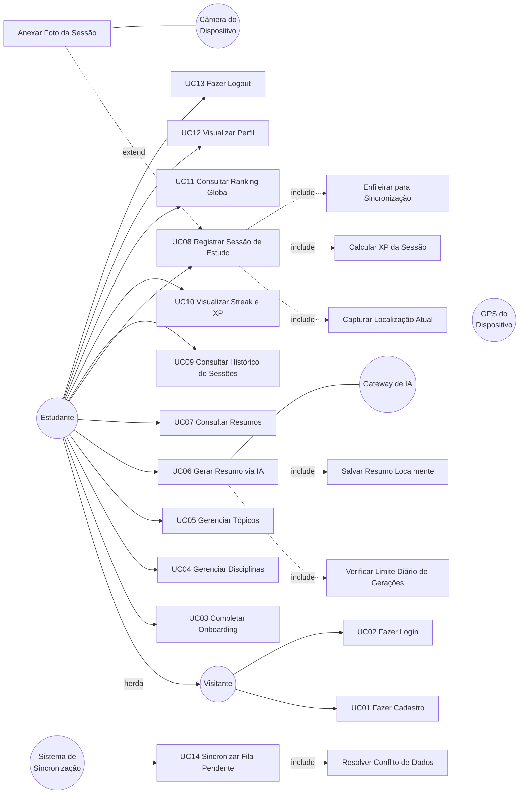

### 2.3 Descrição Textual dos Casos de Uso Críticos

---

#### UC01 — Fazer Cadastro

| Campo | Descrição |
|-------|-----------|
| **Ator primário** | Visitante |
| **Pré-condição** | Usuário não está autenticado; há conexão com a internet |
| **Pós-condição** | Usuário cadastrado no Supabase Auth; conta criada na tabela `profiles`; sessão iniciada localmente |

**Fluxo Principal:**
1. Visitante acessa tela de cadastro
2. Visitante informa email, senha e nome de exibição
3. Sistema envia dados para Supabase Auth
4. Supabase cria conta e retorna token de sessão
5. Sistema persiste token em `expo-secure-store`
6. Sistema cria registro na tabela `profiles` (Supabase)
7. Sistema redireciona para UC03 (Completar Onboarding)

**Fluxos Alternativos:**
- **FA1 — Sem conexão:** Sistema exibe mensagem "Conecte-se à internet para criar sua conta". Cadastro não é possível offline.
- **FA2 — Email já cadastrado:** Supabase retorna erro; sistema exibe "Este email já está em uso".
- **FA3 — Senha fraca:** Supabase rejeita; sistema exibe critérios de senha.

---

#### UC06 — Gerar Resumo via IA

| Campo | Descrição |
|-------|-----------|
| **Ator primário** | Estudante |
| **Ator secundário** | Gateway de IA |
| **Pré-condição** | Estudante autenticado; pelo menos 1 tópico cadastrado; conexão com a internet disponível |
| **Pós-condição** | Resumo gerado e salvo localmente em SQLite; disponível offline |

**Fluxo Principal:**
1. Estudante seleciona tópico na lista de tópicos cadastrados
2. Estudante aciona "Gerar Resumo"
3. Sistema verifica limite diário de gerações (`<<include>>` Verificar Limite)
4. Sistema verifica conexão com a internet
5. Sistema envia tópico (nome + disciplina) para Gateway de IA
6. Gateway de IA retorna resumo textual
7. Sistema salva resumo em SQLite (`<<include>>` Salvar Resumo Localmente)
8. Sistema exibe resumo ao estudante
9. Sistema enfileira registro para sincronização com Supabase

**Fluxos Alternativos:**
- **FA1 — Sem conexão:** Sistema exibe "Conecte-se à internet para gerar um resumo. Seus resumos anteriores estão disponíveis offline." Botão de geração fica desabilitado.
- **FA2 — Limite diário atingido:** Sistema exibe "Você atingiu o limite de 10 resumos hoje. Tente novamente amanhã." (contador reseta à meia-noite local).
- **FA3 — Erro no Gateway de IA:** Sistema exibe "Não foi possível gerar o resumo. Tente novamente." com opção de retry.
- **FA4 — Tópico sem disciplina:** Impedido pela UI (tópico sempre vinculado a disciplina).

---

#### UC08 — Registrar Sessão de Estudo

| Campo | Descrição |
|-------|-----------|
| **Ator primário** | Estudante |
| **Atores secundários** | GPS do Dispositivo, Câmera do Dispositivo |
| **Pré-condição** | Estudante autenticado; pelo menos 1 disciplina e 1 tópico cadastrados |
| **Pós-condição** | Sessão registrada em SQLite com XP calculado; streak atualizado; registro enfileirado para sync |

**Fluxo Principal:**
1. Estudante acessa tela de registro de sessão
2. Estudante seleciona disciplina e tópico
3. Estudante informa duração da sessão (em minutos)
4. Sistema solicita permissão de localização (se não concedida anteriormente)
5. Sistema captura coordenadas GPS (`<<include>>` Capturar Localização Atual)
6. Estudante opta por anexar foto (`<<extend>>` Anexar Foto da Sessão)
7. Sistema cria entidade `SessaoEstudo` com UUID, dados informados, coordenadas e foto
8. Sistema salva sessão em SQLite (status = `pending`)
9. Sistema calcula XP da sessão (`<<include>>` Calcular XP)
10. Sistema atualiza streak do estudante
11. Sistema enfileira registro na `sync_queue` (`<<include>>` Enfileirar para Sincronização)
12. Sistema exibe feedback: "Sessão registrada ✓ +10 XP"

**Fluxos Alternativos:**
- **FA1 — Permissão de localização negada:** Sistema registra sessão **sem coordenadas** (campos `latitude`/`longitude` = `null`). Exibe aviso: "Sessão salva sem localização. Ative o GPS nas configurações para registrar onde você estuda."
- **FA2 — GPS indisponível (timeout):** Mesmo tratamento de FA1. Sessão não é bloqueada.
- **FA3 — Permissão de câmera negada:** Sessão registrada **sem foto**. Estudante informado: "Sem acesso à câmera. Sessão salva sem foto."
- **FA4 — Sem conexão (offline):** Sessão registrada normalmente em SQLite. Enfileirada na `sync_queue`. Upload da foto acontecerá quando houver rede. Feedback: "Sessão salva localmente ✓ Será sincronizada quando houver internet."

---

#### UC14 — Sincronizar Fila Pendente

| Campo | Descrição |
|-------|-----------|
| **Ator primário** | Sistema de Sincronização |
| **Pré-condição** | Existem registros na tabela `sync_queue` com status `pending`; conexão com a internet disponível |
| **Pós-condição** | Registros sincronizados com Supabase; itens processados removidos da `sync_queue`; `sync_status` atualizado |

**Fluxo Principal:**
1. NetInfo detecta que conexão está disponível
2. Sistema de Sincronização consulta tabela `sync_queue` (ordenada por `created_at`)
3. Para cada item da fila:
   - a. Sistema identifica entidade e operação (insert/update/delete)
   - b. Sistema envia dados para Supabase (tabela correspondente)
   - c. Supabase confirma (2xx)
   - d. Sistema marca registro local como `synced`
   - e. Sistema remove item da `sync_queue`
4. Se há fotos com `upload_status = pending`:
   - a. Sistema comprime foto (≤ 800px, qualidade 70%)
   - b. Sistema faz upload para Supabase Storage
   - c. Sistema atualiza `url_remota` e `upload_status = synced`
5. Sistema atualiza `xp_semanal` no Supabase (`profiles`)

**Fluxos Alternativos:**
- **FA1 — Conflito de dados:** Sistema aplica last-write-wins por `updated_at` (`<<include>>` Resolver Conflito). Registro com `updated_at` mais recente prevalece.
- **FA2 — Falha de rede durante sync:** Sistema incrementa `tentativas` no item da fila; reagenda com backoff exponencial (2^n segundos, máximo 5 minutos). Item permanece na fila.
- **FA3 — Erro de validação do servidor:** Item marcado como `error` na `sync_queue`. Não bloqueia processamento dos demais itens.
- **FA4 — Perda de conexão durante processamento:** Sistema para o processamento; retoma quando conexão for reestabelecida. Itens já confirmados permanecem `synced`; pendentes permanecem na fila.

---

#### UC11 — Consultar Ranking Global

| Campo | Descrição |
|-------|-----------|
| **Ator primário** | Estudante |
| **Pré-condição** | Estudante autenticado; conexão com a internet disponível |
| **Pós-condição** | Top 50 estudantes exibidos ordenados por XP semanal |

**Fluxo Principal:**
1. Estudante acessa tela de Ranking
2. Sistema verifica conexão com a internet
3. Sistema faz query no Supabase: `SELECT nome, xp_semanal FROM profiles ORDER BY xp_semanal DESC LIMIT 50`
4. Sistema exibe lista com posição, nome e XP de cada estudante
5. Sistema destaca a posição do estudante atual na lista

**Fluxos Alternativos:**
- **FA1 — Sem conexão:** Sistema exibe mensagem "Conecte-se à internet para ver o ranking." com opção de retry. Pode exibir último ranking cacheado (se houver) com aviso "Dados de [data do cache]".

---

## Checklist da Fase 1

- [x] Requisitos Funcionais numerados e rastreáveis (RF01–RF21)
- [x] Requisitos Não Funcionais com categorias mobile obrigatórias (RNF01–RNF08)
- [x] Categorias sem aplicação no MVP avaliadas e documentadas
- [x] Diagrama de Casos de Uso com atores (Visitante, Estudante, Sistema de Sincronização, Gateway de IA, Câmera, GPS)
- [x] Herança de ator: Estudante herda de Visitante
- [x] Relacionamentos `<<include>>` documentados (Verificar Limite, Salvar Resumo, Capturar Localização, Calcular XP, Enfileirar Sync, Resolver Conflito)
- [x] Relacionamentos `<<extend>>` documentados (Anexar Foto)
- [x] Descrição textual dos 5 casos de uso críticos com pré/pós-condição, fluxo principal e fluxos alternativos
- [x] Fluxo sem rede coberto em todos os casos de uso aplicáveis
- [x] Fluxo de permissão negada coberto (câmera e localização)

---

> **Próxima fase:** Fase 3 — Arquitetura e UI

---

## 3. Modelagem de Dados (Fase 2)

### 3.1 Diagrama de Classes (Domínio)

Este diagrama reflete as entidades de domínio do aplicativo, incorporando os campos necessários para o padrão Offline-First (UUID, timestamps e controle de sincronização). 

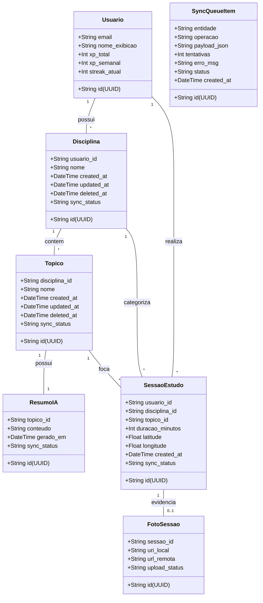

### 3.1.1 Matriz de Persistência — Local (SQLite) vs. Remota (Supabase)

| Classe | Local (SQLite) | Remota (Supabase) | Estratégia |
|--------|----------------|-------------------|------------|
| **Usuario** | Sim — cache de sessão, XP e streak | Sim — `auth.users` + tabela `profiles` | Fonte da verdade: Supabase Auth; cache local para sessão offline e cálculo de XP/streak |
| **Disciplina** | Sim — tabela `disciplinas` (Drizzle ORM) | Sim — tabela `disciplinas` (Postgres) | Fonte da verdade: local até sync; conflito resolvido por last-write-wins (`updated_at`) |
| **Topico** | Sim — tabela `topicos` (Drizzle ORM) | Sim — tabela `topicos` (Postgres) | Fonte da verdade: local até sync; conflito resolvido por last-write-wins (`updated_at`) |
| **ResumoIA** | Sim — tabela `resumos_ia` (Drizzle ORM) | Sim — tabela `resumos_ia` (Postgres) | Gerado online (API de IA) → salvo localmente imediatamente → sync posterior |
| **SessaoEstudo** | Sim — tabela `sessoes_estudo` (Drizzle ORM) | Sim — tabela `sessoes_estudo` (Postgres) | Fonte da verdade: local até sync; conflito resolvido por last-write-wins (`updated_at`) |
| **FotoSessao** | Sim — arquivo no filesystem + linha em `fotos_sessao` | Sim — Supabase Storage (binário) + linha espelho em `fotos_sessao` | Upload de binário assíncrono, separado do sync de dados tabulares; compressão obrigatória (≤800px, 70%) |
| **SyncQueueItem** | Sim — tabela `sync_queue` | Não | Efêmera, exclusivamente local; registros apagados após sync confirmado |

### 3.2 Modelo Relacional Local (DER SQLite)

O banco local atua como a única fonte da verdade (Single Source of Truth) para o app quando offline. O ORM Drizzle fará a interface com estas tabelas. O tipo `sync_status` suporta valores: `pending`, `synced`, `error`.

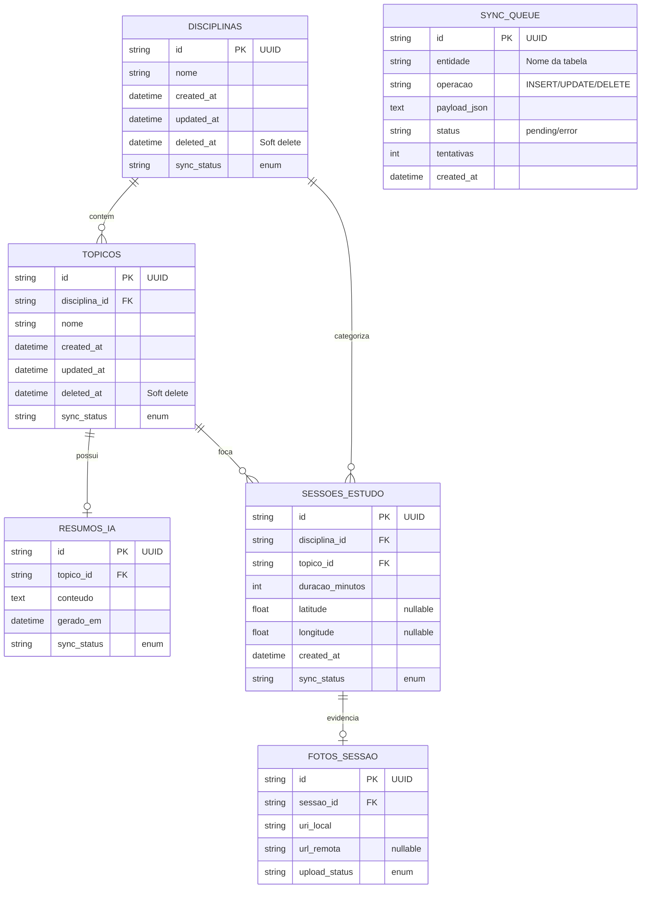

### 3.3 Modelo Relacional Remoto (DER Supabase)

O esquema remoto recebe apenas dados que o Supabase Auth validar, utilizando Row Level Security (RLS) `auth.uid() = profile_id`. Note a ausência da `sync_queue` (exclusiva do ambiente local) e os relacionamentos obrigatórios com `profile_id`.

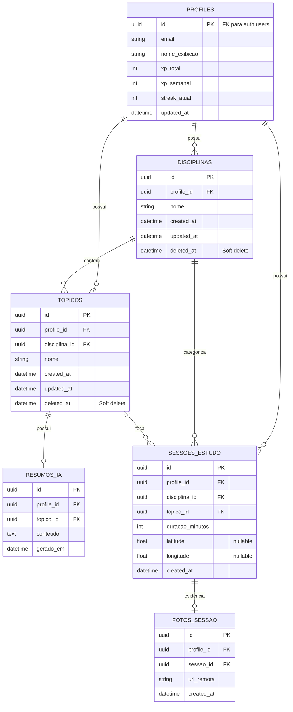

### 3.4 Diagrama de Objetos (Cenário de Sincronização Parcial)

Este diagrama ilustra um momento no aplicativo onde o estudante (Clara) tem uma sessão sincronizada com sucesso e acabou de criar uma nova sessão de estudo (ainda offline), gerando registros na `SyncQueue` local.

```mermaid
objectDiagram
    %% Instância de Usuário logado
    object Clara_App_State {
        id = "user-uuid-123"
        xp_total = 120
        streak = 5
        conexao = "offline"
    }

    %% Sessão 1: Sincronizada no passado
    object Sessao_1 {
        id = "sessao-uuid-001"
        disciplina = "Matemática"
        duracao = 45
        sync_status = "synced"
    }

    %% Sessão 2: Recém criada (offline)
    object Sessao_2 {
        id = "sessao-uuid-002"
        disciplina = "Física"
        duracao = 60
        latitude = -23.5505
        longitude = -46.6333
        sync_status = "pending"
    }

    %% Foto da Sessão 2: Capturada localmente
    object Foto_Sessao_2 {
        id = "foto-uuid-001"
        uri_local = "file:///data/user/0/app/image.jpg"
        url_remota = null
        upload_status = "pending"
    }

    %% Item da Fila para Sessão 2
    object SyncItem_Sessao {
        id = "queue-uuid-001"
        entidade = "sessoes_estudo"
        operacao = "INSERT"
        status = "pending"
    }

    %% Item da Fila para Foto da Sessão 2
    object SyncItem_Foto {
        id = "queue-uuid-002"
        entidade = "fotos_sessao"
        operacao = "UPLOAD"
        status = "pending"
    }

    Clara_App_State -- Sessao_1 : "histórico"
    Clara_App_State -- Sessao_2 : "histórico"
    Sessao_2 -- Foto_Sessao_2 : "evidencia"
    SyncItem_Sessao -- Sessao_2 : "aponta_para"
    SyncItem_Foto -- Foto_Sessao_2 : "aponta_para"
```

---

## Checklist da Fase 2

- [x] Diagrama de Classes contendo entidades do domínio (Usuario, Disciplina, Topico, SessaoEstudo, FotoSessao, ResumoIA, SyncQueueItem).
- [x] Atributos Offline-First detalhados (UUIDs no cliente, sync_status, created_at, updated_at, deleted_at para soft deletes).
- [x] DER Local (SQLite) modelado sem dados de auth, mas com fila de sync (Outbox).
- [x] DER Remoto (Supabase) modelado contendo referências diretas a `profile_id` em todas as tabelas filhas para aplicar regras rígidas de Row Level Security (RLS).
- [x] Diagrama de Objetos construído com Mermaid comprovando a existência de estado misto (itens `synced` misturados com `pending`).

---

> **Próxima fase:** Fase 4 — Implementação (DDD + Clean Architecture + TDD)

---

## 4. Diagrama de Estados (Fase 3)

### 4.1 Ciclo de Sincronização — Entidades de Dados

Aplica-se a toda entidade sincronizável: `Disciplina`, `Topico`, `ResumoIA`, `SessaoEstudo`. O atributo controlado é `sync_status`.

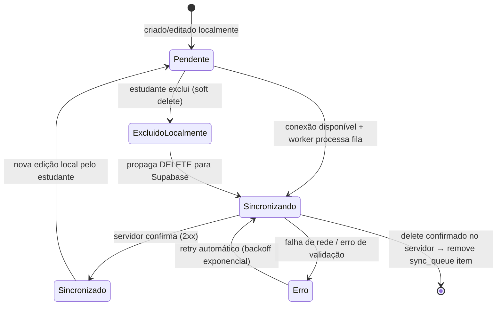

### 4.2 Ciclo de Upload — Foto de Sessão

Aplica-se à entidade `FotoSessao`. O atributo controlado é `upload_status`. O upload é separado do sync de dados tabulares.

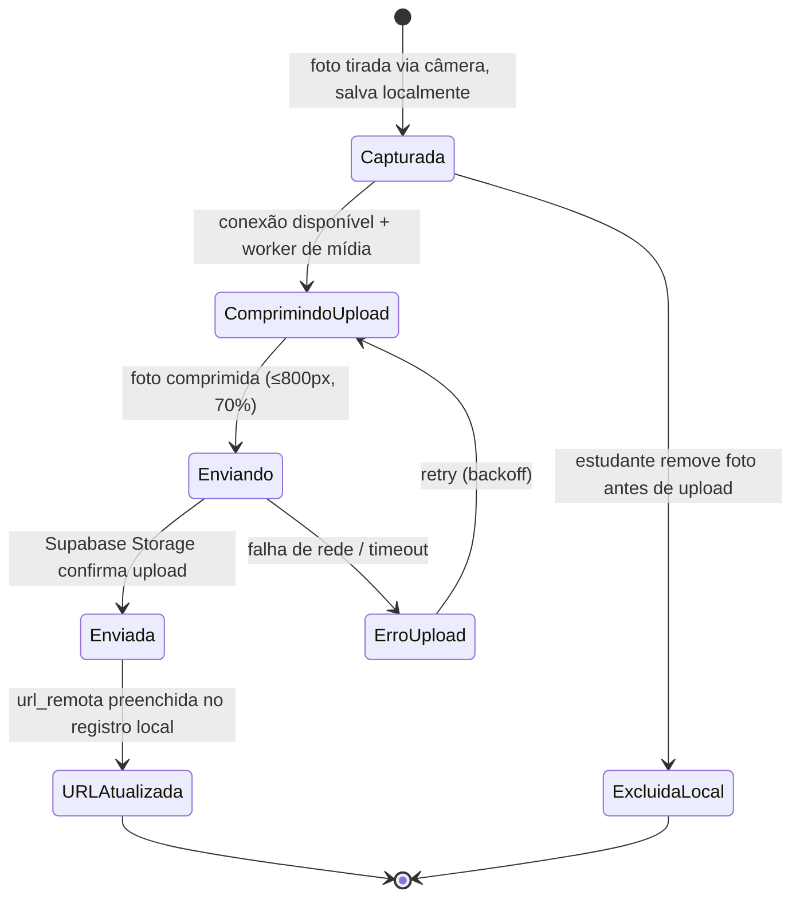

---

## 5. Classes de Fronteira, Controle e Entidade — BCE (Fase 3)

### 5.1 Classificação

| Tipo | Papel | Exemplos no StudyRats |
|------|-------|-----------------------|
| **Boundary (UI)** | Telas Expo Router — ponto de contato com o estudante | `LoginScreen`, `CadastroScreen`, `OnboardingScreen`, `DisciplinaFormScreen`, `TopicoFormScreen`, `ResumoScreen`, `SessaoFormScreen`, `HistoricoSessoesScreen`, `StreakXPScreen`, `RankingScreen`, `PerfilScreen` |
| **Boundary (Nativo/Externo)** | Wrappers de SDK que implementam interfaces do domínio | `CameraGateway`, `LocationGateway`, `AuthGateway`, `SyncGateway`, `AIGateway` |
| **Control** | Orquestram casos de uso — não guardam estado persistente, não conhecem SDKs | `CadastrarDisciplinaUseCase`, `CadastrarTopicoUseCase`, `GerarResumoUseCase`, `RegistrarSessaoUseCase`, `AutenticarUsuarioUseCase`, `ConsultarRankingUseCase`, `SincronizarFilaUseCase` |
| **Entity** | Dados de domínio persistentes (do Diagrama de Classes, Seção 3) | `Usuario`, `Disciplina`, `Topico`, `ResumoIA`, `SessaoEstudo`, `FotoSessao`, `SyncQueueItem` |

### 5.2 Tabela de Mapeamento por Caso de Uso

| Caso de Uso | Boundary (UI) | Boundary (Nativo/Externo) | Control | Entities |
|---|---|---|---|---|
| UC01 Fazer Cadastro | `CadastroScreen` | `AuthGateway` | `AutenticarUsuarioUseCase` | `Usuario` |
| UC02 Fazer Login | `LoginScreen` | `AuthGateway` | `AutenticarUsuarioUseCase` | `Usuario` |
| UC03 Completar Onboarding | `OnboardingScreen` | — | — | — |
| UC04 Gerenciar Disciplinas | `DisciplinaFormScreen` | — | `CadastrarDisciplinaUseCase` | `Disciplina` |
| UC05 Gerenciar Tópicos | `TopicoFormScreen` | — | `CadastrarTopicoUseCase` | `Topico` |
| UC06 Gerar Resumo via IA | `ResumoScreen` | `AIGateway` | `GerarResumoUseCase` | `Topico`, `ResumoIA` |
| UC08 Registrar Sessão | `SessaoFormScreen` | `CameraGateway`, `LocationGateway` | `RegistrarSessaoUseCase` | `SessaoEstudo`, `FotoSessao` |
| UC09 Consultar Histórico | `HistoricoSessoesScreen` | — | — | `SessaoEstudo`, `FotoSessao` |
| UC10 Visualizar Streak e XP | `StreakXPScreen` | — | — | `Usuario` |
| UC11 Consultar Ranking | `RankingScreen` | `SyncGateway` | `ConsultarRankingUseCase` | `Usuario` |
| UC12 Visualizar Perfil | `PerfilScreen` | — | — | `Usuario` |
| UC13 Fazer Logout | `PerfilScreen` | `AuthGateway` | `AutenticarUsuarioUseCase` | `Usuario` |
| UC14 Sincronizar Fila | *(background)* | `SyncGateway` | `SincronizarFilaUseCase` | `Disciplina`, `Topico`, `SessaoEstudo`, `FotoSessao`, `SyncQueueItem` |

### 5.3 Diagrama de Robustez — UC08 Registrar Sessão de Estudo

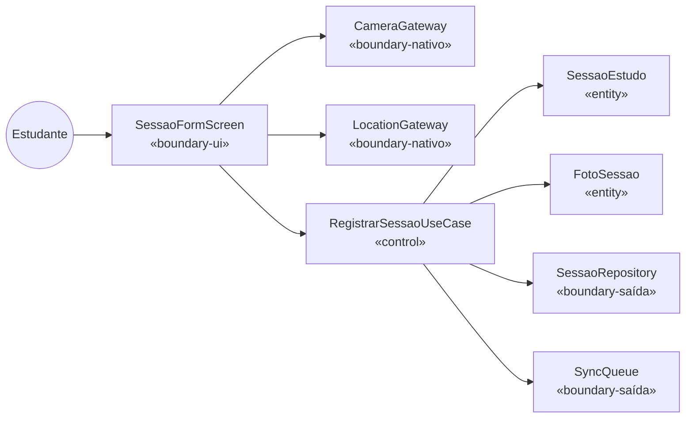

### 5.4 Diagrama de Robustez — UC06 Gerar Resumo via IA

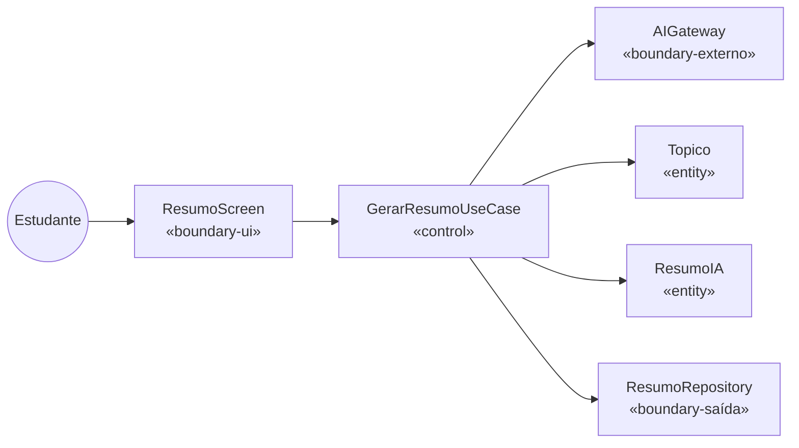

---

## 6. Diagrama de Sequência (Fase 3)

### 6.1 UC08 — Registrar Sessão de Estudo (fluxo offline/online)

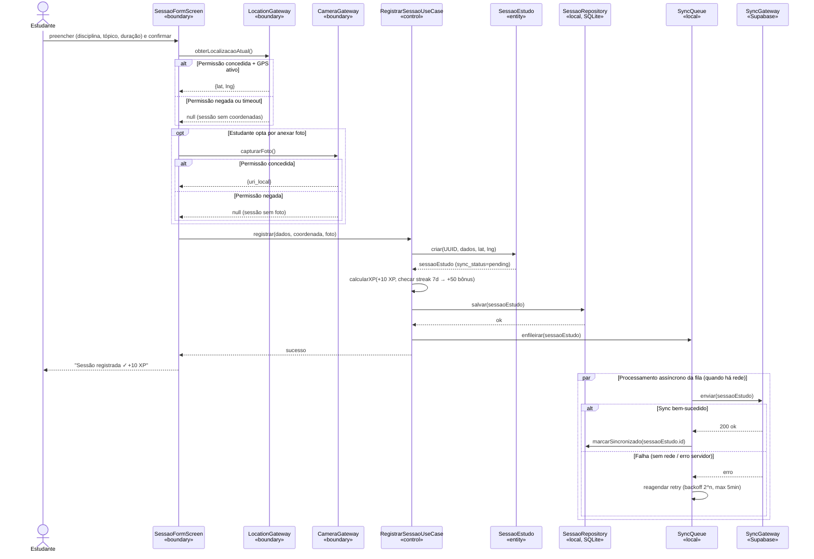

### 6.2 UC06 — Gerar Resumo via IA

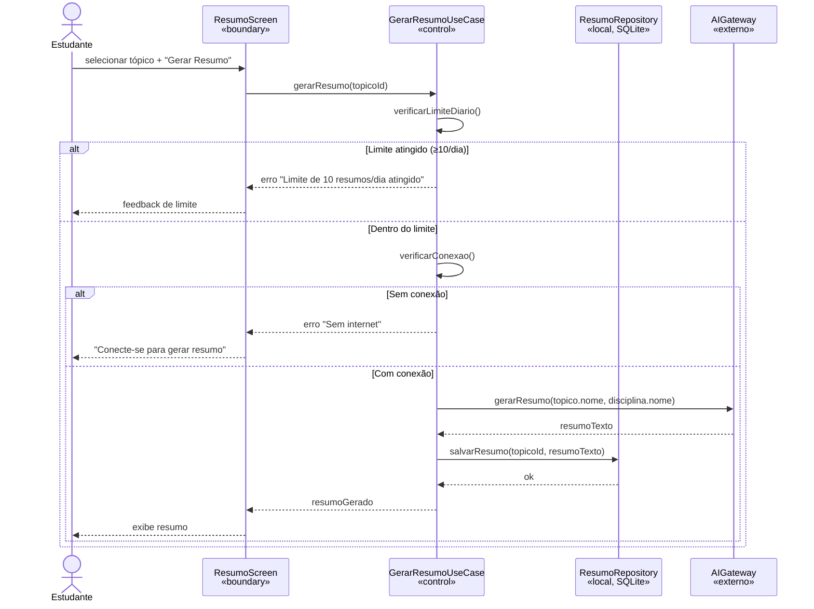

### 6.3 UC14 — Sincronizar Fila Pendente

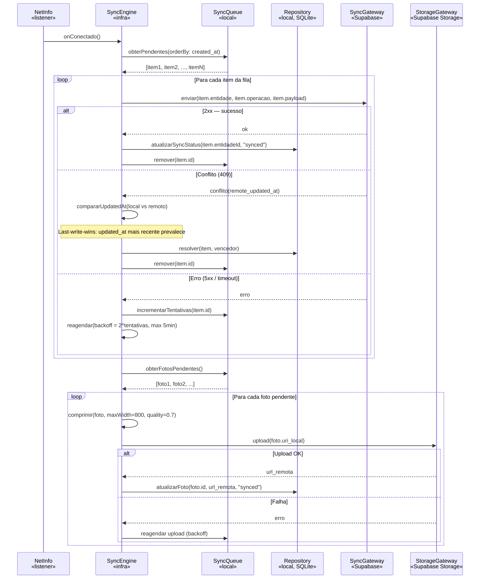

---

## 7. Diagrama de Atividades (Fase 3)

### 7.1 UC08 — Registrar Sessão de Estudo (decisões de permissão + conectividade)

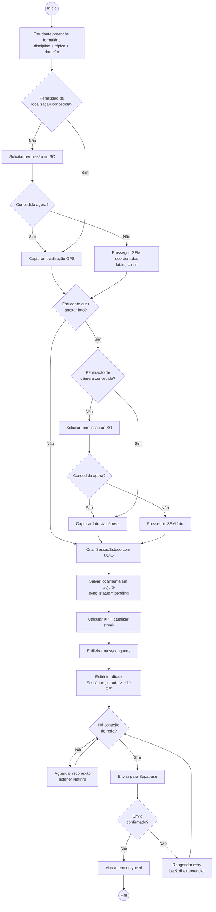

### 7.2 Processo de Sincronização Ponta-a-Ponta (Sync Engine)

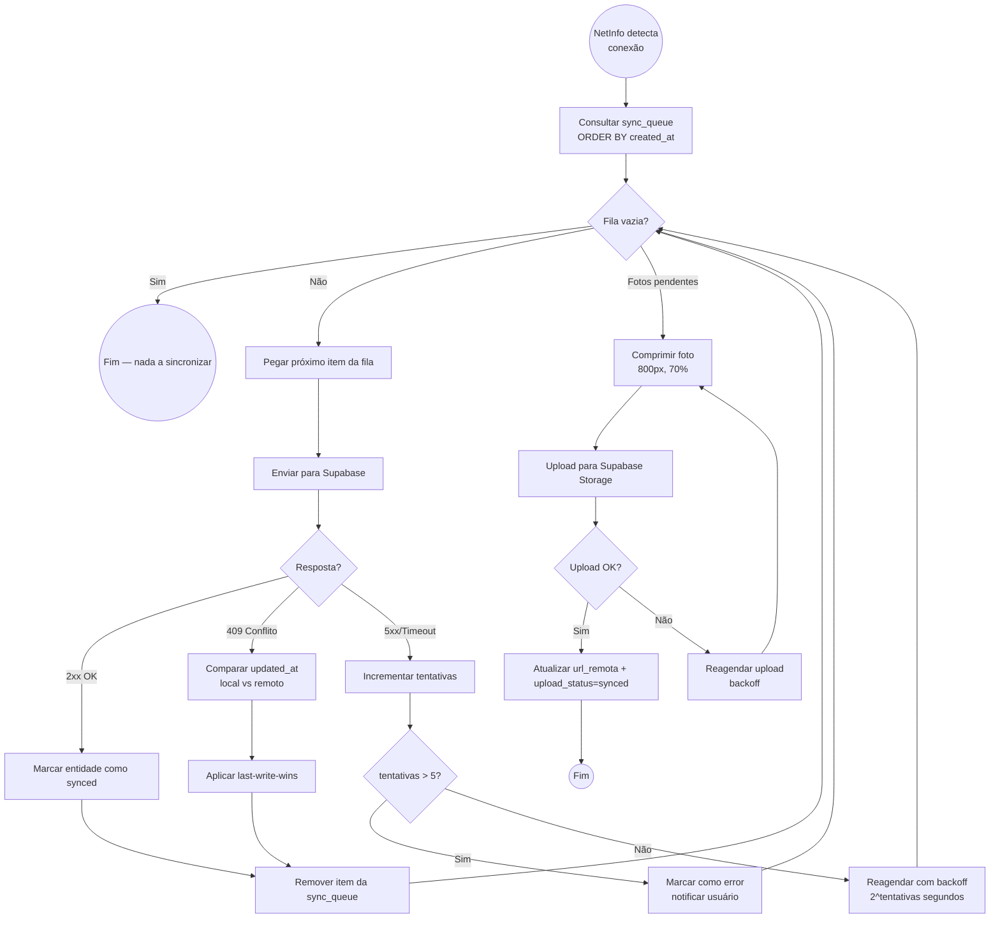

---

## 8. Diagrama de Componentes (Fase 3)

Visão estrutural do app em camadas Clean Architecture, mapeando diretamente as interfaces e implementações documentadas nas seções anteriores.

```mermaid
flowchart TB
    subgraph UI["UI / Expo Router (Boundary de Entrada)"]
        LoginScreen[LoginScreen]
        CadastroScreen[CadastroScreen]
        OnboardingScreen[OnboardingScreen]
        DisciplinaScreen[DisciplinaFormScreen]
        TopicoScreen[TopicoFormScreen]
        ResumoScreen[ResumoScreen]
        SessaoScreen[SessaoFormScreen]
        HistoricoScreen[HistoricoSessoesScreen]
        StreakScreen[StreakXPScreen]
        RankingScreen[RankingScreen]
        PerfilScreen[PerfilScreen]
    end

    subgraph Application["Application (Use Cases)"]
        UCAuth[AutenticarUsuarioUseCase]
        UCDisciplina[CadastrarDisciplinaUseCase]
        UCTopico[CadastrarTopicoUseCase]
        UCResumo[GerarResumoUseCase]
        UCSessao[RegistrarSessaoUseCase]
        UCRanking[ConsultarRankingUseCase]
        UCSync[SincronizarFilaUseCase]
    end

    subgraph Domain["Domain (Regras de Negócio Puras)"]
        direction TB
        subgraph Entities["Entidades"]
            Usuario[Usuario]
            Disciplina[Disciplina]
            Topico[Topico]
            ResumoIA[ResumoIA]
            SessaoEstudo[SessaoEstudo]
            FotoSessao[FotoSessao]
        end
        subgraph ValueObjects["Value Objects"]
            Coordenada[Coordenada]
            StatusSync[StatusSincronizacao]
            EmailVO[Email]
        end
        subgraph Ports["Interfaces (Ports)"]
            ITopicoRepo[[TopicoRepository]]
            ISessaoRepo[[SessaoRepository]]
            IDisciplinaRepo[[DisciplinaRepository]]
            ICameraGW[[CameraGateway]]
            ILocationGW[[LocationGateway]]
            IAuthGW[[AuthGateway]]
            ISyncGW[[SyncGateway]]
            IAIGW[[AIGateway]]
        end
    end

    subgraph Adapters["Adapters (Implementações)"]
        TopicoRepoSQL[TopicoRepositorySQLite]
        SessaoRepoSQL[SessaoRepositorySQLite]
        DisciplinaRepoSQL[DisciplinaRepositorySQLite]
        CameraExpo[CameraGatewayExpo]
        LocationExpo[LocationGatewayExpo]
        AuthSupa[AuthGatewaySupabase]
        SyncSupa[SyncGatewaySupabase]
        AIImpl[AIGatewayLLM]
    end

    subgraph Infra["Frameworks & Drivers"]
        SQLite[(expo-sqlite\n+ Drizzle ORM)]
        ExpoCam[expo-camera\nexpo-image-picker]
        ExpoLoc[expo-location]
        SupaClient[supabase-js]
        NetInfo[NetInfo]
        SyncEngine[SyncEngine\nloop + retry + backoff]
    end

    %% UI → Application
    LoginScreen --> UCAuth
    CadastroScreen --> UCAuth
    DisciplinaScreen --> UCDisciplina
    TopicoScreen --> UCTopico
    ResumoScreen --> UCResumo
    SessaoScreen --> UCSessao
    RankingScreen --> UCRanking

    %% Application → Domain Ports
    UCAuth --> IAuthGW
    UCDisciplina --> IDisciplinaRepo
    UCTopico --> ITopicoRepo
    UCResumo --> IAIGW
    UCResumo --> ITopicoRepo
    UCSessao --> ISessaoRepo
    UCSessao --> ICameraGW
    UCSessao --> ILocationGW
    UCRanking --> ISyncGW
    UCSync --> ISyncGW
    UCSync --> ISessaoRepo
    UCSync --> ITopicoRepo

    %% Adapters -.implementa.-> Ports
    TopicoRepoSQL -.implementa.-> ITopicoRepo
    SessaoRepoSQL -.implementa.-> ISessaoRepo
    DisciplinaRepoSQL -.implementa.-> IDisciplinaRepo
    CameraExpo -.implementa.-> ICameraGW
    LocationExpo -.implementa.-> ILocationGW
    AuthSupa -.implementa.-> IAuthGW
    SyncSupa -.implementa.-> ISyncGW
    AIImpl -.implementa.-> IAIGW

    %% Adapters → Infra
    TopicoRepoSQL --> SQLite
    SessaoRepoSQL --> SQLite
    DisciplinaRepoSQL --> SQLite
    CameraExpo --> ExpoCam
    LocationExpo --> ExpoLoc
    AuthSupa --> SupaClient
    SyncSupa --> SupaClient
    SyncEngine --> NetInfo
    SyncEngine --> UCSync
```

> [!IMPORTANT]
> **Regra de dependência:** Setas sempre apontam de quem depende para quem é dependido. `Domain` **nunca** tem seta saindo em direção a `Adapters`/`Infra` — só recebe implementações via interface. `expo-camera`, `expo-location`, `supabase-js` e `drizzle-orm` **nunca** aparecem importados em `Domain` ou `Application`.

---

## Checklist da Fase 3

- [x] Diagrama de Estados do ciclo de sincronização (`pending` → `sincronizando` → `sincronizado` / `erro`) para entidades de dados.
- [x] Diagrama de Estados do ciclo de upload para `FotoSessao` (`capturada` → `comprimindo` → `enviando` → `enviada`).
- [x] Classificação BCE: Boundary (UI + Nativo/Externo), Control (Use Cases), Entity (Domínio).
- [x] Tabela de mapeamento BCE por caso de uso (14 UCs mapeados).
- [x] Diagramas de robustez para UC08 (Registrar Sessão) e UC06 (Gerar Resumo).
- [x] Diagrama de Sequência UC08 com fluxo offline/online, `par`/`alt`, permissões de câmera e GPS.
- [x] Diagrama de Sequência UC06 com verificação de limite diário e conexão.
- [x] Diagrama de Sequência UC14 (Sincronizar Fila) com loop de processamento, conflito, retry e upload de fotos.
- [x] Diagrama de Atividades UC08 com decisão de permissão (localização + câmera) e conectividade.
- [x] Diagrama de Atividades do Sync Engine ponta-a-ponta.
- [x] Diagrama de Componentes com todas as camadas Clean Architecture, gateways nativos e regra de dependência documentada.
