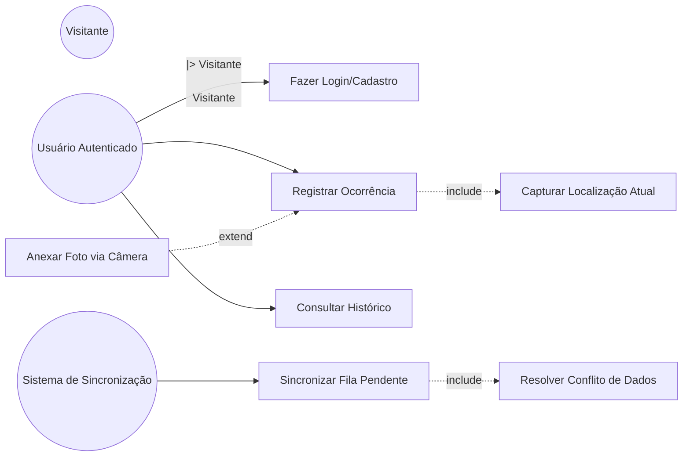
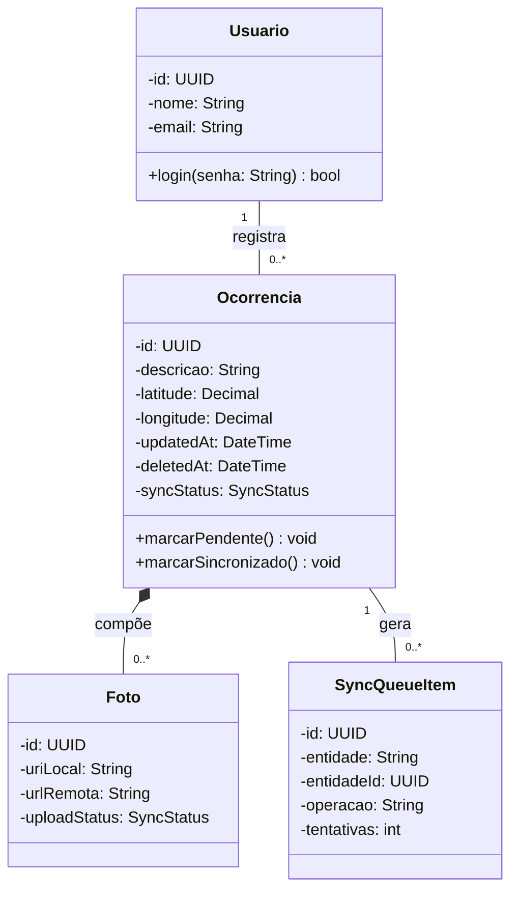
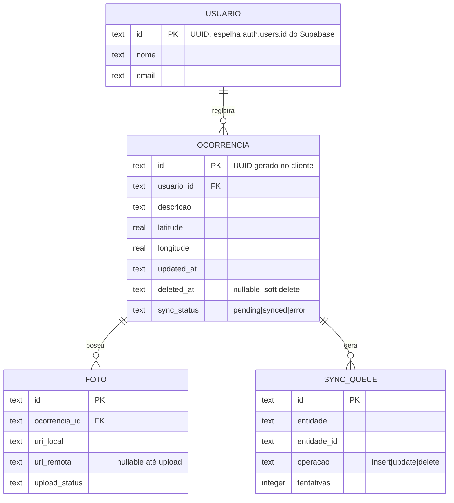
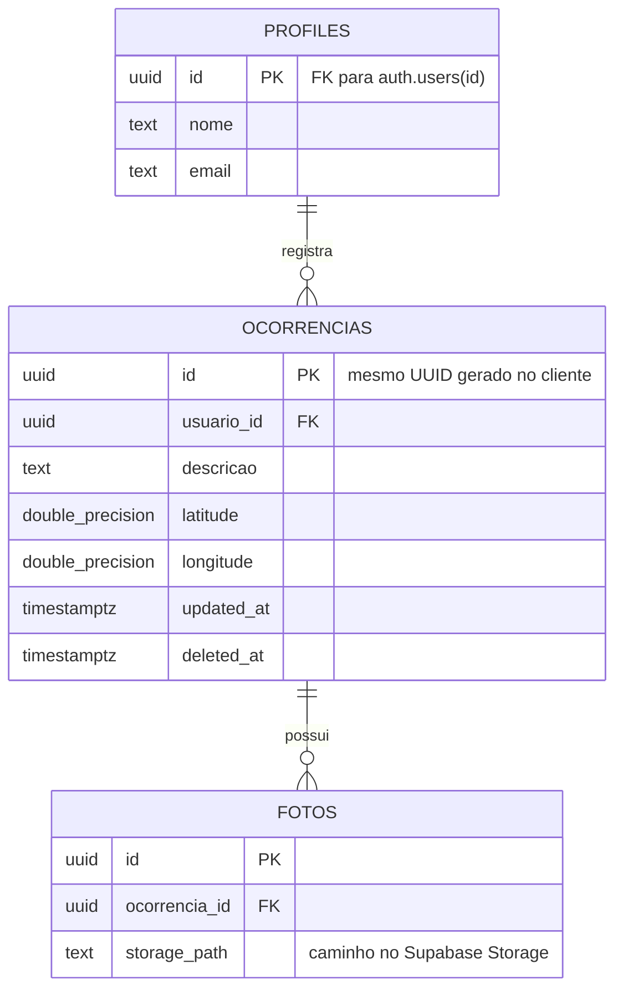
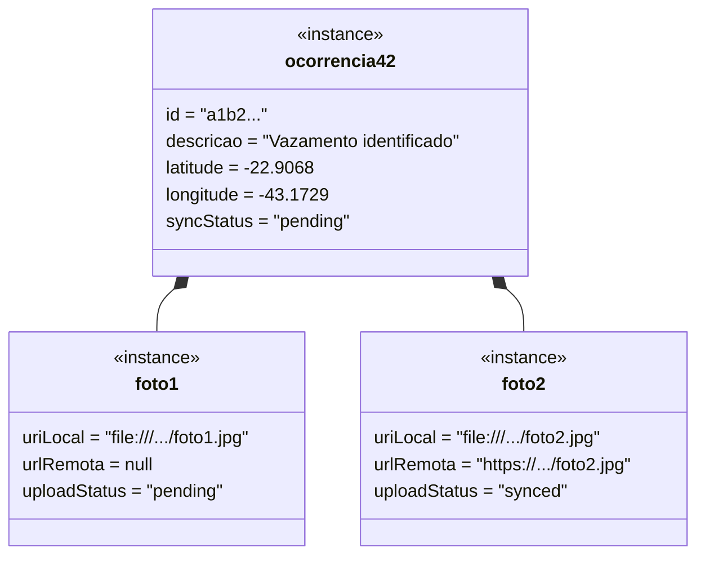
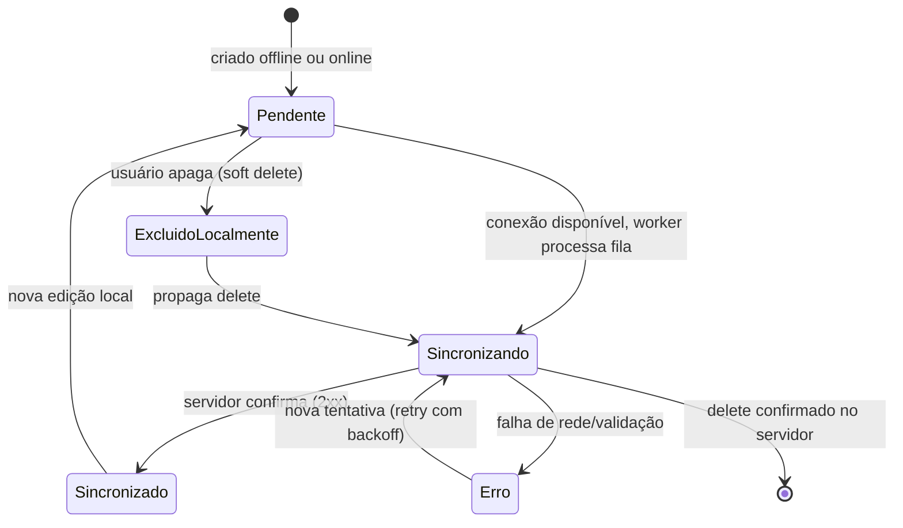
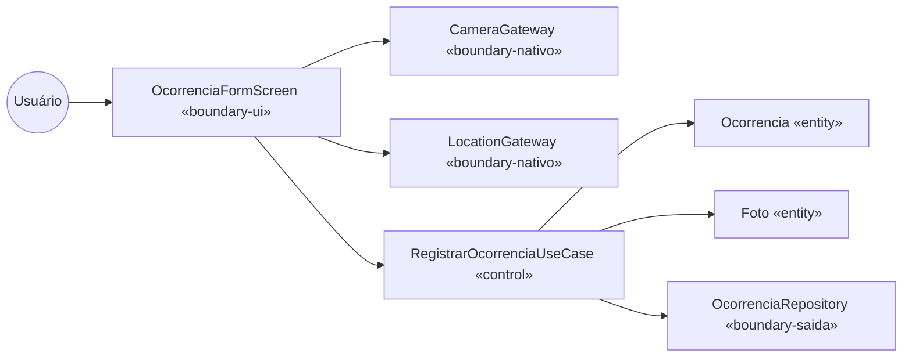
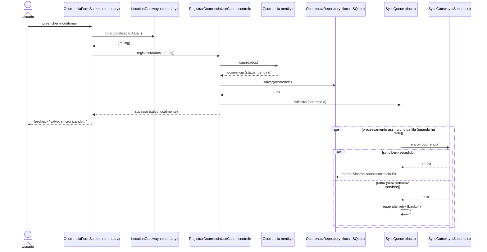
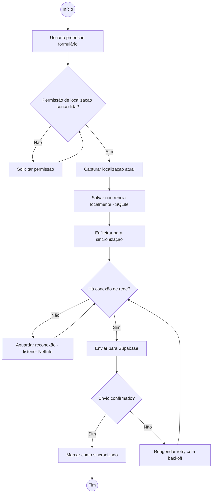
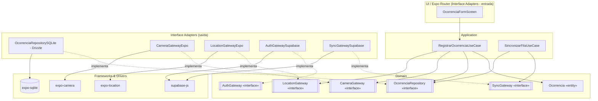

# Documento de Software Mobile (Expo/React Native)

Guia produção de documento de análise e projeto para app mobile construído com Expo + React Native. Sempre seguir ordem abaixo — cada seção alimenta a próxima (requisito → ator/caso de uso → classe → diagrama de atividade). Este skill é a especialização de `software-design-doc` para mobile: mesma espinha dorsal UML + DDD + Clean Architecture + TDD, com adições específicas de app mobile offline-first (recursos nativos, persistência local, sincronização com backend).

Perguntar ao usuário, antes de começar, se ainda não souber:
- Domínio do sistema (o que o app faz), usuários-alvo, principais funcionalidades.
- Plataformas alvo (iOS, Android, ambas) e se é Expo managed workflow ou bare/dev client (relevante pra quais módulos nativos estão disponíveis sem eject).
- Grau de offline-first exigido: app funciona 100% sem rede (só sincroniza quando possível) ou só tolera intermitência curta?
- Quais dos três recursos nativos centrais (câmera, geolocalização, autenticação) são obrigatórios e como são usados no domínio (ex: câmera pra registrar evidência de vistoria, geolocalização pra check-in, auth pra multiusuário).

Sem esse contexto mínimo, não inventar requisitos genéricos demais.

Entregar documento final como arquivo Markdown no repo (ex: `docs/documento-software-mobile.md`) ou artifact, conforme pedido do usuário. Diagramas em Mermaid (renderizam nativo em artifacts e no GitHub).

## Stack de referência (default recomendado, ajustável por RNF)

Adotar como padrão salvo o usuário pedir outra coisa — registrar no documento qualquer desvio e o motivo:

| Camada | Escolha default | Alternativa |
|--------|-----------------|-------------|
| Framework | Expo (managed ou dev client) + React Native + Expo Router | Bare React Native |
| Persistência local | SQLite via `expo-sqlite`, ORM **Drizzle ORM** (schema tipado, migrations) | WatermelonDB (melhor pra datasets muito grandes/reativos) |
| Backend/BaaS | **Supabase** (Postgres, Auth, Storage, Realtime) como *BaaS* | Firebase |
| Câmera | `expo-camera` / `expo-image-picker` | — |
| Geolocalização | `expo-location` (foreground e background) | — |
| Autenticação | Supabase Auth (`@supabase/supabase-js`), sessão persistida em `expo-secure-store` | Auth0, Clerk |
| Sincronização | Fila local (`outbox` pattern) + `@react-native-community/netinfo` pra detectar conectividade + processo de sync sob demanda/background | WatermelonDB sync protocol nativo |
| Testes | Jest (`jest-expo` preset) + `@testing-library/react-native`, mocks de módulos nativos | Detox (E2E, opcional) |

> Nota de terminologia: o usuário se referiu a "IAS" — trata-se de **BaaS** (Backend as a Service). Supabase cobre banco (Postgres), autenticação, storage de arquivos e realtime, funcionando como o backend gerenciado do app.

## 1. Levantamento de Requisitos

Tabela de requisitos funcionais (RF) e não funcionais (RNF), numerados, rastreáveis — mesmo formato do documento genérico, com categorias adicionais obrigatórias pra mobile.

**Requisito Funcional (RF)**: comportamento/função que o app deve executar. Formato: `RFxx — Verbo + objeto + condição`.

**Requisito Não Funcional (RNF)**: qualidade, restrição, atributo. Formato: `RNFxx — categoria: descrição + critério mensurável`.

Template:

| ID | Descrição | Prioridade | Ator/Origem |
|----|-----------|-----------|-------------|
| RF01 | App deve permitir que usuário capture foto via câmera e associe a [entidade] | Alta | Usuário |
| RF02 | App deve registrar localização atual do usuário ao criar [entidade] | Alta | Usuário |
| RF03 | App deve permitir login/logout de usuário autenticado | Alta | Usuário |
| RF04 | App deve funcionar sem conexão, enfileirando alterações pra sincronizar depois | Alta | Usuário |
| RNF01 | App deve permitir criar/editar registros com dispositivo em modo avião | Alta | Equipe |
| RNF02 | Sincronização de fila pendente deve completar em até 30s sob rede 4G, para até 50 registros | Média | Equipe |

Categorias RNF específicas de mobile, sempre avaliar (registrar mesmo se "não se aplica"):
- **Offline-first**: quais telas/ações funcionam sem rede; o que fica bloqueado.
- **Permissões de dispositivo**: câmera, localização (foreground/background), notificações — momento em que são solicitadas (nunca no cold start sem contexto) e comportamento se negadas.
- **Uso de bateria/dados**: frequência de captura de geolocalização, tamanho/compressão de imagem antes de upload.
- **Armazenamento local**: limite de espaço em disco (mídia + banco SQLite), política de limpeza de dados sincronizados antigos.
- **Sincronização/consistência**: estratégia de resolução de conflito (default: last-write-wins por `updated_at`), tolerância a duplicidade.
- **Segurança**: token de sessão em `expo-secure-store` (nunca `AsyncStorage` puro pra credencial), Row Level Security no Supabase.
- **Compatibilidade**: versões mínimas de iOS/Android suportadas.
- **Usabilidade**: feedback visual de estado de sincronização (pendente/sincronizado/erro) visível ao usuário.

Cada RF vira candidato a caso de uso na seção 2. Cada RNF vira restrição de arquitetura/design (RNF de offline → decide desenho da fila de sync na seção 9-10; RNF de permissão → vira fluxo alternativo no caso de uso e no diagrama de atividades).

## 2. Diagrama de Casos de Uso

Elementos obrigatórios (iguais ao documento genérico) + atores típicos de app mobile:

- **Atores**: `Usuário` (pessoa), `Sistema de Sincronização` (processo em background/ator de tempo), `Supabase` (sistema externo), `Câmera do Dispositivo`/`GPS do Dispositivo` (atores externos de hardware, se o caso de uso depender deles diretamente).
- **Herança de ator**: ex: `UsuarioAutenticado --|> Visitante` se o app tiver navegação livre antes do login.
- **`<<include>>`**: comportamento sempre necessário. Ex: `Registrar Ocorrência` inclui `Capturar Localização Atual` (sempre roda).
- **`<<extend>>`**: comportamento opcional. Ex: `Anexar Foto` estende `Registrar Ocorrência` só se usuário optar.

Mermaid:



Notação textual alternativa, incluindo caso de uso de sincronização (sempre presente em app offline-first):

```
Ator: Visitante
Ator: Usuário Autenticado (herda de Visitante)
Ator: Sistema de Sincronização (ator de tempo/background)

UC01 Fazer Login/Cadastro
UC02 Registrar Ocorrência
  <<include>> UC03 Capturar Localização Atual
  <<extend>> UC04 Anexar Foto via Câmera (ponto de extensão: antes de salvar)
UC05 Consultar Histórico (dado local, com ou sem rede)
UC06 Sincronizar Fila Pendente (Sistema de Sincronização)
  <<include>> UC07 Resolver Conflito de Dados
```

Cada caso de uso relevante deve ter descrição textual: ator, pré-condição, fluxo principal, fluxos alternativos (incluir explicitamente **fluxo sem rede** e **fluxo de permissão negada** quando aplicável), pós-condição.

## 3. Diagrama de Classes

Extrair classes candidatas dos substantivos dos casos de uso e requisitos, igual ao documento genérico. Em app offline-first, toda entidade sincronizável ganha atributos de controle de sync — modelar isso explicitamente:

- `id` (UUID gerado no cliente, não autoincremento — evita colisão ao criar offline).
- `updated_at` (timestamp, usado pra last-write-wins).
- `deleted_at` (soft delete, nunca deletar linha fisicamente antes de confirmar sync).
- `sync_status` (`pending` | `synced` | `error`).

Mermaid classDiagram:



**Persistência**: em app offline-first, quase toda entidade de domínio existe em **dois lugares** — marcar as duas:

| Classe | Persistente local (SQLite) | Persistente remota (Supabase) | Estratégia |
|--------|------------------------------|-------------------------------|------------|
| Usuario | Sim (cache de sessão) | Sim (`auth.users` + tabela `profiles`) | Fonte da verdade: Supabase Auth; cache local só pra sessão offline |
| Ocorrencia | Sim (tabela `ocorrencias`, ORM Drizzle) | Sim (tabela `ocorrencias`, Postgres) | Fonte da verdade: local até sync, depois remota; `updated_at` decide conflito |
| Foto | Sim (arquivo local + linha na tabela `fotos`) | Sim (Supabase Storage + linha espelho) | Upload de arquivo binário assíncrono, separado do sync de dados tabulares |
| SyncQueueItem | Sim (tabela `sync_queue`) | Não | Efêmera, só existe localmente, apagada após sync confirmado |

### 3.1 Diagrama Entidade-Relacionamento (DER)

Em app mobile offline-first, fazer **dois DERs** (ou um DER com nota indicando o que é espelhado): schema local SQLite e schema remoto Supabase/Postgres. Eles devem ser estruturalmente equivalentes nas tabelas de domínio (mesmos campos de negócio); a diferença fica nas colunas de controle de sync e em tabelas auxiliares que só existem de um lado.

Regra de conversão classe → tabela: igual ao documento genérico (composição/agregação 1-N vira FK no lado "muitos"; herança usa discriminador por padrão; value object vira coluna embutida).

Mermaid `erDiagram` (schema local, SQLite via Drizzle):



Mermaid `erDiagram` (schema remoto, Supabase/Postgres — sem `SYNC_QUEUE`, que é só local):



Conferir que cardinalidade dos dois DERs bate com a multiplicidade do diagrama de classes (seção 3) e entre si — divergência entre schema local e remoto é a causa mais comum de bug de sincronização, não variação aceitável.

Registrar sempre: **RLS (Row Level Security)** do Supabase por tabela remota (ex: usuário só lê/escreve suas próprias `ocorrencias` via policy `usuario_id = auth.uid()`).

## 4. Diagrama de Objetos

Igual ao documento genérico: instantâneo do diagrama de classes com valores reais, útil aqui principalmente pra validar um cenário de sincronização concreto (ex: uma `Ocorrencia` com duas `Foto`s, uma já sincronizada e outra ainda `pending`).

Mermaid:



Usar pra conferir que estado misto (parte sincronizada, parte pendente) da mesma entidade-pai é possível e está corretamente modelado — cenário clássico de app offline-first que vira massa de teste na seção 10 (TDD).

## 5. Diagrama de Estados (obrigatório para entidade sincronizável)

Diferente do documento genérico (onde essa seção é condicional), em app offline-first **sempre existe** pelo menos uma entidade com ciclo de vida de sincronização — então essa seção normalmente não é dispensada aqui. Perguntar ao usuário só se há *outra* entidade de domínio (além do ciclo de sync) com estados de negócio próprios (ex: status de aprovação de um pedido).

Estado de sincronização, por entidade sincronizável (`Ocorrencia`, `Foto`, etc.):



Se houver entidade com ciclo de vida de negócio adicional (ex: `Ocorrencia` também tem status `Aberta → EmAndamento → Resolvida`), fazer diagrama de estados separado pra esse atributo, igual ao documento genérico — os dois ciclos (sync e negócio) são independentes e não devem ser misturados no mesmo diagrama.

Ligar de volta ao atributo `syncStatus`/`uploadStatus` do diagrama de classes (seção 3) — na implementação (seção 10) essa máquina de estados vira validação dentro da entidade de domínio e do serviço de sincronização, nunca troca de status "solta".

## 6. Classes de Fronteira, Controle e Entidade (Boundary-Control-Entity)

Reclassificação vira, na seção 10, as camadas de Clean Architecture. Em app mobile, boundary inclui tanto UI quanto **gateways de recursos nativos** — ambos são "fronteira" porque são o ponto de contato com algo externo ao domínio (usuário de um lado, hardware/SDK do outro).

- **Boundary (Fronteira) — lado UI**: telas Expo Router, componentes. Nome sugerido: `XxxScreen`, `XxxForm`.
- **Boundary (Fronteira) — lado recurso nativo**: wrapper de SDK nativo/Supabase, interface no domínio + implementação no adapter. Nome sugerido: `CameraGateway`, `LocationGateway`, `AuthGateway`, `SyncGateway`.
- **Control (Controle)**: orquestra caso de uso, não guarda estado persistente, não conhece `expo-camera`/`expo-location`/`supabase-js` diretamente — só as interfaces de gateway. Nome sugerido: `XxxUseCase`.
- **Entity (Entidade)**: dado de domínio persistente, do diagrama de classes seção 3.

Regra: 1 boundary de UI por tela; 1 boundary de gateway por recurso nativo/externo (câmera, localização, auth, sync com Supabase); 1 control por caso de uso; entidades vêm do diagrama de classes.

Diagrama de robustez por caso de uso `Registrar Ocorrência`:



Tabela de mapeamento:

| Caso de Uso | Boundary (UI) | Boundary (nativo/externo) | Control | Entities envolvidas |
|-------------|----------------|-----------------------------|---------|----------------------|
| Registrar Ocorrência | OcorrenciaFormScreen | CameraGateway, LocationGateway | RegistrarOcorrenciaUseCase | Ocorrencia, Foto |
| Fazer Login | LoginScreen | AuthGateway (Supabase Auth) | AutenticarUsuarioUseCase | Usuario |
| Sincronizar Fila Pendente | (nenhuma, roda em background) | SyncGateway (Supabase) | SincronizarFilaUseCase | Ocorrencia, Foto, SyncQueueItem |

## 7. Diagrama de Sequência

Um diagrama por caso de uso relevante. Em app offline-first, o diagrama de sequência de qualquer ação de escrita deve mostrar **dois momentos separados**: (1) gravação local imediata, sempre síncrona e sempre bem-sucedida do ponto de vista do usuário; (2) sincronização remota, assíncrona, condicionada a rede disponível.



Rastreabilidade: mesmos nomes de boundary/control/entity da tabela da seção 6, mesma ordem de chamada que vira teste de use case (TDD, seção 10). Sempre incluir ao menos um diagrama de sequência mostrando o caminho de sincronização em `par`/`alt` como acima — é o fluxo mais propenso a bug em app offline-first.

## 8. Diagrama de Atividades

Um diagrama por caso de uso complexo ou processo ponta a ponta. Em app mobile, sempre modelar explicitamente a decisão de conectividade e de permissão — são os dois pontos de ramificação mais comuns.



Se fluxo cruza múltiplos atores (Usuário / Sistema de Sincronização), descrever raias em texto antes do diagrama, igual ao documento genérico.

## 9. Diagrama de Componentes

Visão estrutural do app em módulos e dependências — materialização das camadas de Clean Architecture (seção 10). Fazer depois de definir as camadas.



Regra de leitura: seta sempre aponta de quem depende pra quem é dependido; `Domain` nunca tem seta saindo em direção a `Adapters`/`Infra` — só recebe (via interface implementada). `expo-camera`, `expo-location` e `supabase-js` só aparecem dentro de `Infra`/`Adapters`, nunca importados em `Domain`/`Application`.

## 10. Implementação: DDD, Clean Architecture, TDD (Expo/React Native)

Depois do documento pronto (seções 1-9), usar como insumo direto pra implementação. Domínio primeiro, depois aplicação, depois infra/UI. Nunca começar pelo schema do banco ou pela tela.

### DDD (Domain-Driven Design)

Extrair do diagrama de classes (seção 3):

- **Entidade de domínio**: `Ocorrencia`, `Usuario` — objeto puro, sem `import` de `expo-sqlite`, `expo-camera`, `expo-location` ou `@supabase/supabase-js`.
- **Value Object**: `Coordenada` (lat/lng com validação de range), `StatusSincronizacao` (enum `pending|synced|error`).
- **Aggregate e Aggregate Root**: `Ocorrencia` é raiz; `Foto` só é acessada através dela (`ocorrencia.adicionarFoto(foto)`, nunca `fotoRepository` manipulando `Foto` isolada fora do agregado).
- **Repository**: interface no domínio (`OcorrenciaRepository`), implementação SQLite/Drizzle na infra. Um repository por aggregate root.
- **Gateway** (especialização de porta pra recurso externo não persistente): `CameraGateway`, `LocationGateway`, `AuthGateway`, `SyncGateway` — mesma ideia de repository (interface no domínio, implementação no adapter), mas pra recurso de hardware/SDK externo em vez de armazenamento.
- **Domain Service**: `SincronizacaoService` — decide resolução de conflito (`updated_at` local vs remoto) quando envolve mais de um agregado/comparação externa.
- **Linguagem ubíqua**: nomear conforme domínio real do app (não usar `Manager`/`Helper` genérico).

| Aggregate Root | Entidades internas | Value Objects | Repository | Gateways envolvidos |
|-----------------|--------------------|----------------|-------------|------------------------|
| Ocorrencia | Foto | Coordenada, StatusSincronizacao | OcorrenciaRepository | CameraGateway, LocationGateway, SyncGateway |
| Usuario | — | Email | UsuarioRepository (cache local) | AuthGateway |

### Clean Architecture (camadas)

Mapear direto da seção 6/9. Regra de dependência: **camada externa depende da interna, nunca o contrário**. Interfaces (ports) ficam no domínio; implementações (adapters) usam os SDKs Expo/Supabase.

```
src/
  domain/
    entities/            <- Ocorrencia, Usuario, Foto
    value-objects/       <- Coordenada, StatusSincronizacao
    repositories/         <- interfaces: OcorrenciaRepository, UsuarioRepository
    gateways/              <- interfaces: CameraGateway, LocationGateway, AuthGateway, SyncGateway
  application/
    use-cases/             <- RegistrarOcorrenciaUseCase, AutenticarUsuarioUseCase, SincronizarFilaUseCase
  adapters/
    screens/                 <- telas Expo Router (boundary de entrada), usam hooks que chamam use-cases
    repositories/              <- OcorrenciaRepositorySQLite (Drizzle)
    gateways/
      camera/                    <- CameraGatewayExpo (wrap expo-camera / expo-image-picker)
      location/                  <- LocationGatewayExpo (wrap expo-location)
      auth/                      <- AuthGatewaySupabase (wrap supabase-js Auth)
      sync/                      <- SyncGatewaySupabase (wrap supabase-js + upload Storage)
  infra/
    db/
      schema.ts                   <- schema Drizzle (tabelas locais SQLite)
      client.ts                   <- setup expo-sqlite + drizzle
      migrations/
    supabase/
      client.ts                   <- setup supabase-js, config de RLS documentada
    sync/
      sync-engine.ts               <- loop de processamento da sync_queue, listener NetInfo, retry/backoff
      background-task.ts            <- registro de tarefa em background (expo-task-manager), se RNF exigir sync sem app aberto
```

Regra prática de checagem: se um arquivo em `domain/` ou `application/` importar `expo-camera`, `expo-location`, `expo-sqlite`, `drizzle-orm` ou `@supabase/supabase-js` diretamente → violação, mover a chamada pro adapter correspondente e expor só a interface.

Detalhe de fronteira útil em RN: hooks React (`useOcorrencias`, `useAuth`) ficam em `adapters/` (ou numa camada `presentation/` fina acima deles) — eles adaptam o use case pro ciclo de vida de componente, não substituem o use case.

### TDD (Test-Driven Development)

Ciclo **red → green → refactor**, de dentro pra fora (domínio → use case → gateway/adapter), com Jest (`jest-expo` preset) + `@testing-library/react-native`:

1. **Domínio** (mais rápido, maior volume de testes): teste de `Ocorrencia.marcarPendente()`, `Coordenada` rejeita lat/lng fora de range, `Ocorrencia.adicionarFoto()` respeita invariante do agregado. Sem mock nenhum — objeto puro.
2. **Use case**: teste de `RegistrarOcorrenciaUseCase` usando **fakes in-memory** de `OcorrenciaRepository`, `CameraGateway`, `LocationGateway` (implementações de teste que satisfazem a interface do domínio, não mocks de framework). Cobre: caminho feliz, permissão de localização negada, geolocalização indisponível.
3. **Gateway/adapter isolado**: teste de `LocationGatewayExpo`/`CameraGatewayExpo` com o módulo Expo mockado via `jest.mock('expo-location', ...)`/`jest.mock('expo-camera', ...)` — confirma que o wrapper traduz corretamente a API nativa pra interface do domínio, incluindo erro de permissão negada.
4. **Repository contra SQLite real**: teste de `OcorrenciaRepositorySQLite` (Drizzle) rodando contra SQLite real (in-memory ou arquivo temporário) — cobre mapeamento ORM, migrations, soft delete.
5. **Sync engine**: teste do fluxo de fila (`sync_queue` → `SyncGatewaySupabase`) mockando `supabase-js` (ou usando `supabase-js` contra projeto Supabase local/`supabase start`) — cobre retry/backoff e resolução de conflito por `updated_at`.
6. **Componente/tela** (menor quantidade): `@testing-library/react-native` renderizando `OcorrenciaFormScreen` com use case fake injetado, cobrindo interação de usuário e estados de loading/erro/permissão.
7. **E2E (opcional, pouquíssimos)**: Detox ou Maestro, só pro caminho crítico completo (login → registrar ocorrência offline → reconectar → confirmar sincronizado).

Pirâmide de testes esperada: muitos testes de domínio/use case, testes médios de repository/gateway/adapter, poucos de componente, pouquíssimos e2e. Câmera e geolocalização **nunca** são exercitadas de verdade em teste automatizado (dependem de hardware) — sempre via gateway mockado/fake; a integração real é validada manualmente ou em Detox rodando em device/simulador.

Cada RF da seção 1 deve ter pelo menos um teste que comprove aceitação (rastreabilidade RF → caso de uso → teste). RNFs de offline/sync devem ter teste dedicado simulando ausência de rede (ex: `NetInfo` mockado retornando `isConnected: false`).

## Checklist final do documento

Antes de entregar, confirmar que documento contém, nesta ordem:

1. [ ] Requisitos funcionais e não funcionais (tabela), incluindo categorias mobile (offline, permissões, bateria/dados, armazenamento local, sincronização, segurança, compatibilidade)
2. [ ] Diagrama de casos de uso com atores (+ herança de ator, incluindo ator de Sistema de Sincronização), include, extend
3. [ ] Descrição textual dos casos de uso principais (pré/pós-condição, fluxos, incluindo fluxo sem rede e fluxo de permissão negada)
4. [ ] Diagrama de classes com composição, agregação, herança, multiplicidades e atributos de controle de sync
5. [ ] Marcação de persistência local (SQLite) e remota (Supabase) de cada entidade
6. [ ] Diagramas entidade-relacionamento (DER) local e remoto, com RLS documentado
7. [ ] Diagrama de objetos validando cenário de estado misto (parcialmente sincronizado)
8. [ ] Diagrama de estados do ciclo de sincronização (pending/synced/error) — e de ciclo de negócio adicional, se existir
9. [ ] Classes de fronteira/controle/entidade mapeadas por caso de uso, com boundary de UI separado de boundary de recurso nativo/gateway
10. [ ] Diagrama de sequência dos casos de uso principais, incluindo fluxo assíncrono de sincronização
11. [ ] Diagrama(s) de atividade cobrindo decisão de permissão e decisão de conectividade
12. [ ] Diagrama de componentes (camadas Clean Architecture + gateways de câmera/localização/auth/sync)
13. [ ] Mapeamento DDD (aggregates, entidades, value objects, repositories, gateways)
14. [ ] Estrutura de camadas Clean Architecture (domain/application/adapters/infra) sem SDK nativo/ORM vazando pra domain/application
15. [ ] Plano de testes TDD por caso de uso (domínio → use case com fakes → gateway/adapter mockado → repository real → componente → e2e opcional)

Rastreabilidade: cada RF deve aparecer em pelo menos um caso de uso; cada caso de uso relevante deve aparecer na tabela boundary/control/entity e no diagrama de sequência; cada entity sincronizável deve ter estado de sync mapeado; cada gateway de recurso nativo deve ter interface no domínio e implementação testável isoladamente; cada use case implementado deve ter teste de aceitação ligado ao RF de origem.
