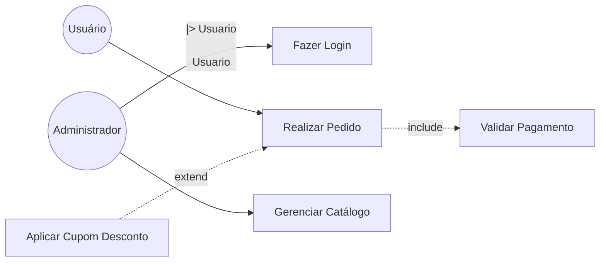
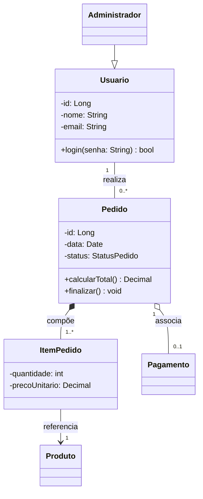
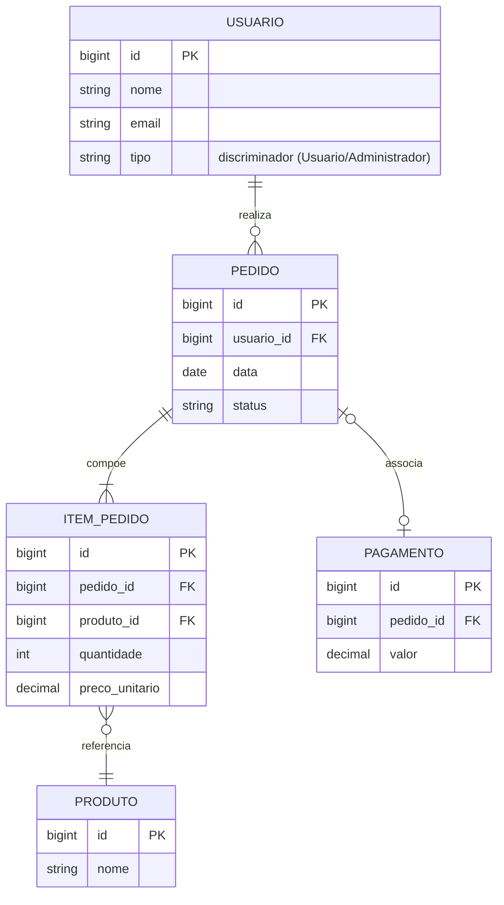
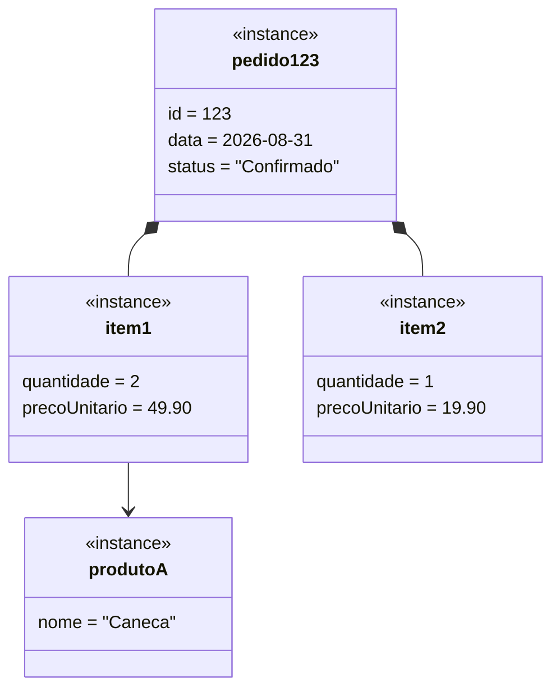
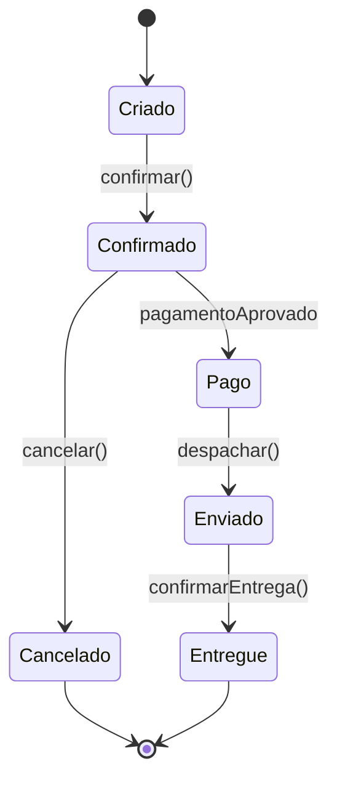
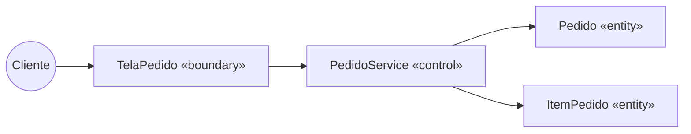
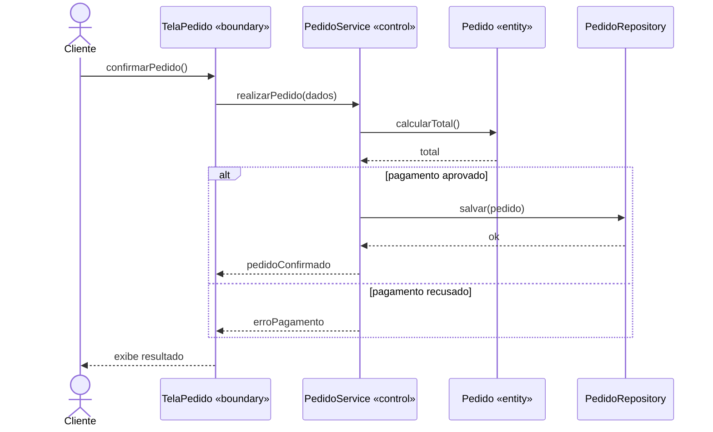
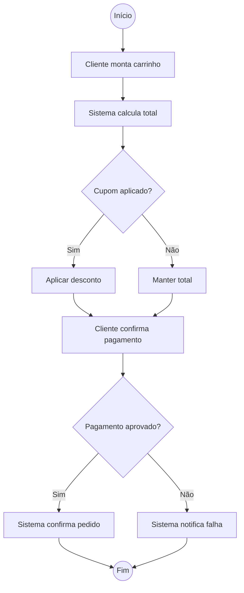
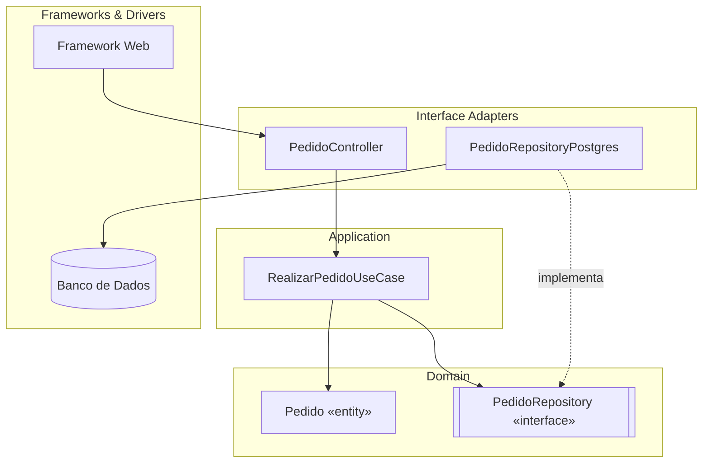

# Documento de Software (Análise e Projeto)

Guia produção de documento de software completo. Sempre seguir ordem abaixo — cada seção alimenta a próxima (requisito → ator/caso de uso → classe → diagrama de atividade).

Perguntar ao usuário domínio do sistema (o que o software faz) antes de começar, se ainda não souber. Sem domínio claro, não inventar requisitos genéricos demais — pedir contexto mínimo (usuários, principais funcionalidades, restrições).

Entregar documento final como arquivo Markdown no repo (ex: `docs/documento-software.md`) ou artifact, conforme pedido do usuário. Diagramas em Mermaid (renderizam nativo em artifacts e no GitHub).

## 1. Levantamento de Requisitos

Tabela de requisitos funcionais (RF) e não funcionais (RNF), numerados, rastreáveis.

**Requisito Funcional (RF)**: comportamento/função que sistema deve executar. Formato: `RFxx — Verbo + objeto + condição`.

**Requisito Não Funcional (RNF)**: qualidade, restrição, atributo (desempenho, segurança, usabilidade, disponibilidade, portabilidade, escalabilidade, conformidade legal). Formato: `RNFxx — categoria: descrição + critério mensurável`.

Template:

| ID | Descrição | Prioridade | Ator/Origem |
|----|-----------|-----------|-------------|
| RF01 | Sistema deve permitir que [ator] realize [ação] | Alta/Média/Baixa | Cliente |
| RNF01 | Tempo de resposta de login deve ser < 2s sob carga de 100 usuários simultâneos | Alta | Equipe |

Categorias RNF comuns: desempenho, segurança, usabilidade, confiabilidade, manutenibilidade, portabilidade, escalabilidade, compliance/legal.

Cada RF vira candidato a caso de uso na seção 2. Cada RNF vira restrição de arquitetura/design (ex: RNF de persistência → decide entidades persistentes na seção 3).

## 2. Diagrama de Casos de Uso

Elementos obrigatórios:
- **Atores**: papéis externos (pessoa, sistema externo, tempo/cron). Ator primário inicia caso de uso; secundário participa.
- **Herança de ator**: ator especializado herda casos de uso do ator geral (seta de generalização, triângulo vazado apontando pro ator geral). Ex: `Administrador --|> Usuário`.
- **`<<include>>`**: comportamento obrigatório, sempre executado, fatorado de múltiplos casos de uso (seta tracejada, direção caso-base → caso incluído).
- **`<<extend>>`**: comportamento opcional/condicional, insere-se em ponto de extensão do caso base (seta tracejada, direção caso-extensão → caso-base).

Regra prática pra não confundir include/extend: se comportamento é sempre necessário para o caso base completar → include. Se é opcional/alternativo, só ocorre em certa condição → extend.

Mermaid (usar `flowchart` já que Mermaid não tem use-case nativo, ou usar notação textual):



Se preferir notação PlantUML-style em texto simples dentro do documento (mais fiel ao padrão UML de caso de uso), oferecer como alternativa:

```
Ator: Cliente
Ator: Administrador (herda de Cliente)

UC01 Fazer Login
UC02 Realizar Pedido
  <<include>> UC03 Validar Pagamento
  <<extend>> UC04 Aplicar Cupom (ponto de extensão: antes de finalizar pedido)
UC05 Gerenciar Catálogo (Administrador)
```

Cada caso de uso relevante deve ter descrição textual: ator, pré-condição, fluxo principal, fluxos alternativos, pós-condição.

## 3. Diagrama de Classes

Extrair classes candidatas dos substantivos dos casos de uso e requisitos. Definir atributos, métodos, visibilidade (+public, -private, #protected), multiplicidade nas associações.

Relações a diferenciar:
- **Herança/Generalização**: `ClasseFilha --|> ClasseMae`. "É um".
- **Composição**: parte não existe sem o todo, ciclo de vida atrelado. Losango preenchido no lado do todo. `Pedido *-- ItemPedido`.
- **Agregação**: parte pode existir independente do todo, associação "tem um" fraca. Losango vazio. `Departamento o-- Funcionario`.
- **Associação simples**: relação sem posse forte, com multiplicidade.

Mermaid classDiagram:



**Persistência**: marcar quais classes são entidades persistentes (mapeadas em banco). Usar estereótipo `<<entity>>` ou anotação e indicar chave primária/estratégia (ex: ORM, tabela). Documentar ao lado do diagrama:

| Classe | Persistente? | Estratégia | Observação |
|--------|-------------|-----------|------------|
| Usuario | Sim | Tabela `usuario`, PK id | — |
| Pagamento | Sim | Tabela `pagamento`, FK pedido_id | Composição com Pedido |
| StatusPedido | Não (enum) | — | Valor embutido |

### 3.1 Diagrama Entidade-Relacionamento (DER)

Derivar direto da tabela de persistência acima: só entram as classes marcadas `Persistente? = Sim`. Enquanto diagrama de classes (seção 3) mostra visão de objeto (composição, agregação, herança, comportamento), o DER mostra visão relacional — tabela, chave primária (PK), chave estrangeira (FK), cardinalidade da FK.

Regra de conversão classe → tabela:
- Composição/agregação 1-N (`Pedido *-- ItemPedido`) → FK na tabela do lado "muitos", apontando pra PK do lado "um" (`item_pedido.pedido_id → pedido.id`).
- Associação N-N → tabela associativa própria com FK composta pras duas pontas (ex: `Produto` N-N `Categoria` vira tabela `produto_categoria`).
- Herança (`Administrador --|> Usuario`) → escolher estratégia e registrar no documento: tabela única com discriminador, tabela por subclasse com FK pra tabela mãe, ou tabela por classe concreta (todos os atributos duplicados). Default recomendado: tabela única com coluna `tipo` discriminadora, salvo RNF que exija outra.
- Value Object / enum (não persistente como entidade própria) → vira coluna(s) embutida(s) na tabela do dono, não tabela separada.

Mermaid `erDiagram`:



Notação de cardinalidade Mermaid (lado esquerdo/direito da relação): `||` exatamente um, `o|` zero ou um, `}o` zero ou muitos, `}|` um ou muitos. Conferir que toda cardinalidade aqui bate com a multiplicidade equivalente do diagrama de classes (seção 3) — divergência entre os dois é erro de modelagem, não variação aceitável.

Incluir DER sempre que houver pelo menos uma entidade persistente; se sistema não persiste dado nenhum (ex: serviço stateless puro), pular e registrar no documento que foi avaliado e não se aplicou.

## 4. Diagrama de Objetos

Instantâneo (snapshot) do diagrama de classes em tempo de execução: objetos concretos (instâncias), com valores reais de atributos, e links (instâncias de associação) entre eles. Usar pra validar/exemplificar as multiplicidades e relações definidas na seção 3 com um cenário real do domínio — não é obrigatório pra todo caso de uso, só onde a cardinalidade ou a composição/agregação não é óbvia.

Notação: nome do objeto sublinhado no formato `nomeObjeto: Classe`, atributos com valor preenchido, sem métodos.

Mermaid (usar `classDiagram` com instâncias, já que Mermaid não tem diagrama de objetos nativo):



Usar principalmente pra: conferir se composição/agregação da seção 3 está correta (ex: `item1`/`item2` só existem enquanto `pedido123` existir), e pra dar exemplo concreto de dado que vira massa de teste na seção 10 (TDD).

## 5. Diagrama de Estados (condicional)

Antes de montar esse diagrama, **perguntar ao usuário** se alguma entidade do diagrama de classes (seção 3) tem ciclo de vida complexo — vários status possíveis, com regras de quais transições são permitidas e por quem. Candidatos típicos: pedido, conta/assinatura, chamado/ticket, reserva, processo de aprovação. Se nenhuma entidade se encaixa, pular essa seção e registrar no documento que foi perguntado e não se aplicou.

Se existir entidade candidata, um diagrama de estados por entidade (não por caso de uso). Elementos: estado inicial (•), estados nomeados, transição rotulada com `evento [guarda] / ação`, estado final (◉).

Mermaid:



Ligar de volta ao atributo de status do diagrama de classes (ex: `StatusPedido` da seção 3) — o diagrama de estados é o detalhamento dos valores possíveis desse atributo e das regras de transição, que na implementação (seção 10) viram validação dentro do método da entidade de domínio (nunca troca de status "solta", sem passar pela regra).

## 6. Classes de Fronteira, Controle e Entidade (Boundary-Control-Entity)

Reclassificar (ou derivar) as classes do diagrama de classes em 3 estereótipos de análise. Essa separação vira depois, na seção 10, as camadas de Clean Architecture (boundary → adapter/interface, control → use case, entity → domain).

- **Boundary (Fronteira)**: tudo que interage com ator externo — telas, APIs REST, formulários. Nome sugerido: `XxxTela`, `XxxController` (se for API REST), `XxxView`.
- **Control (Controle)**: lógica de aplicação, orquestra fluxo do caso de uso, não guarda estado persistente. Nome sugerido: `XxxService`, `XxxUseCase`.
- **Entity (Entidade)**: dado de domínio persistente, do diagrama de classes seção 3. Nome sugerido: nome do domínio puro (`Pedido`, `Usuario`).

Regra: 1 boundary por tela/interface de ator; 1 control por caso de uso (ou agrupamento coeso de casos de uso relacionados); entidades vêm do diagrama de classes.

Diagrama de robustez (robustness diagram) simplificado por caso de uso, mostrando fluxo ator → boundary → control → entity:



Tabela de mapeamento (uma linha por caso de uso):

| Caso de Uso | Boundary | Control | Entities envolvidas |
|-------------|----------|---------|---------------------|
| Realizar Pedido | TelaPedido | PedidoService | Pedido, ItemPedido, Produto |

## 7. Diagrama de Sequência

Um diagrama por caso de uso relevante, complementando o diagrama de robustez da seção 6 com ordem temporal explícita das mensagens entre os mesmos objetos (ator, boundary, control, entities). Preferir sobre o diagrama de robustez quando a ordem/repetição/alternativa das chamadas importa pro entendimento (ex: validação antes de persistir, retry, chamada condicional).

Elementos: linha de vida (lifeline) por objeto participante, mensagem síncrona (seta cheia) com retorno (seta tracejada), mensagem assíncrona (seta aberta), fragmento `alt` (alternativa/condição), fragmento `loop` (repetição).

Mermaid:



Rastreabilidade: mesmos nomes de boundary/control/entity da tabela da seção 6, mesma ordem de chamada que vira depois teste de use case (TDD, seção 10).

## 8. Diagrama de Atividades

Um diagrama por caso de uso complexo (fluxo com decisão, alternativas, paralelismo) ou por processo de negócio ponta a ponta.

Elementos: nó inicial (•), nó final (◉), ação (retângulo arredondado), decisão/mescla (losango), fork/join (barra sincronização — paralelismo), raia (swimlane) por ator/responsável quando fluxo cruza múltiplos atores/sistemas.

Mermaid:



Para paralelismo (fork/join), usar mermaid `flowchart` com múltiplos ramos saindo do mesmo nó e convergindo, anotando `(fork)`/`(join)` no rótulo do nó, já que Mermaid não tem símbolo nativo de barra de sincronização.

Se sistema tem múltiplos atores no mesmo fluxo, preferir descrever raias em texto (Raia Cliente / Raia Sistema / Raia Operador) antes do diagrama, listando quais ações pertencem a cada raia.

## 9. Diagrama de Componentes

Visão estrutural do sistema em módulos/pacotes e suas dependências — a materialização das camadas de Clean Architecture (seção 10) num diagrama. Fazer depois de definir as camadas, não antes; esse diagrama documenta a arquitetura, não a decide.

Elementos: componente (retângulo com ícone/estereótipo `<<component>>`), interface fornecida/requerida (círculo/soquete ou notação `<<interface>>`), dependência entre componentes (seta tracejada).

Mermaid (usar `flowchart` com subgraphs por camada, já que Mermaid não tem componente nativo):



Regra de leitura: seta sempre aponta de quem depende para quem é dependido; `Domain` nunca tem seta saindo em direção a `Adapters`/`Infra` — só recebe (via interface implementada).

## 10. Implementação: DDD, Clean Architecture, TDD

Depois do documento pronto (seções 1-9), usar como insumo direto pra implementação. Regra geral: entities/RF/casos de uso do documento viram código nessa ordem — domínio primeiro, depois aplicação, depois infra/interface. Nunca começar pelo banco ou pelo controller.

### DDD (Domain-Driven Design)

Extrair do diagrama de classes (seção 3) e do glossário de requisitos:

- **Entidade de domínio**: tem identidade própria, ciclo de vida (ex: `Pedido`, `Usuario`). Igual às entities da seção 3/4, mas aqui sem dependência de framework/ORM — objeto de domínio puro.
- **Value Object**: sem identidade, imutável, comparado por valor (ex: `Endereco`, `Dinheiro`, `CPF`). Bom candidato: atributo com validação/regra própria dentro do requisito.
- **Agregado (Aggregate) e Aggregate Root**: fronteira de consistência. Composição da seção 3 (`Pedido *-- ItemPedido`) geralmente = aggregate: `Pedido` é a raiz, `ItemPedido` só acessado através dela. Nunca referenciar `ItemPedido` direto de fora do agregado.
- **Repository**: interface no domínio (`PedidoRepository`), implementação na infra. Um repository por aggregate root, não por entidade filha.
- **Domain Service**: regra de negócio que não pertence a uma entidade só (envolve mais de um aggregate).
- **Linguagem ubíqua**: nomear classes/métodos com os mesmos termos do requisito e do caso de uso (não traduzir pra termo técnico genérico tipo `Manager`/`Helper`/`Processor`).

Tabela de mapeamento aggregate:

| Aggregate Root | Entidades internas | Value Objects | Repository |
|-----------------|--------------------|--------------|-------------|
| Pedido | ItemPedido | Dinheiro, Endereco | PedidoRepository |

### Clean Architecture (camadas)

Mapear direto da seção 6 (boundary/control/entity), regra de dependência: **camada externa depende da interna, nunca o contrário**. Interfaces (ports) ficam na camada de dentro, implementações (adapters) fora.

Camadas, de dentro pra fora:

1. **Domain/Entities** — entidades e value objects DDD (sem dependência de nada externo).
2. **Application/Use Cases** — 1 classe por caso de uso da seção 2 (ex: `RealizarPedidoUseCase`), equivale ao "Control" da seção 6. Depende só de interfaces de repository/gateway definidas no domínio ou na própria camada de aplicação.
3. **Interface Adapters** — controllers, presenters, gateways/repository implementations. Equivale ao "Boundary" da seção 6 do lado de entrada, e a implementação concreta de repository do lado de saída.
4. **Frameworks & Drivers** — banco de dados (ORM), framework web, filas, UI. Detalhe substituível.

Regra prática de checagem: se importar uma lib de banco (ORM, driver SQL) dentro de arquivo de use case ou entidade → violação, mover pra camada de adapter/infra.

```
src/
  domain/            <- entidades, value objects, interfaces de repository
  application/        <- use cases, orquestra domínio via interfaces
  adapters/
    controllers/       <- boundary de entrada (REST, CLI)
    repositories/       <- implementação concreta (ex: PedidoRepositoryPostgres)
  infra/               <- config framework, ORM, conexão banco
```

### TDD (Test-Driven Development)

Implementar cada caso de uso seguindo ciclo **red → green → refactor**, sempre de dentro pra fora (domínio → use case → adapter):

1. Escrever teste de unidade da regra de domínio (entidade/value object) antes do código — ex: `Pedido.calcularTotal()` deve aplicar desconto se cupom válido.
2. Rodar teste, ver falhar (red).
3. Escrever código mínimo pra passar (green).
4. Refatorar mantendo teste verde.
5. Subir um nível: teste do use case (`RealizarPedidoUseCase`), usando fake/in-memory repository (não mockar entidade de domínio, só repository/gateway externo).
6. Por último, teste de integração/adapter (repository real contra banco, controller HTTP) — menor quantidade, mais lento, cobre só o que a lógica unitária não cobre (mapeamento ORM, serialização HTTP).

Pirâmide de testes esperada: muitos testes unitários de domínio/use case, poucos de integração, pouquíssimos e2e.

Cada RF da seção 1 deve ter pelo menos um teste que comprove aceitação (rastreabilidade RF → caso de uso → teste).

## Checklist final do documento

Antes de entregar, confirmar que documento contém, nesta ordem:

1. [ ] Requisitos funcionais e não funcionais (tabela)
2. [ ] Diagrama de casos de uso com atores (+ herança de ator), include, extend
3. [ ] Descrição textual dos casos de uso principais (pré/pós-condição, fluxos)
4. [ ] Diagrama de classes com composição, agregação, herança e multiplicidades
5. [ ] Marcação de persistência das entidades
6. [ ] Diagrama entidade-relacionamento (DER) — feito se houver entidade persistente, dispensado com registro se não
7. [ ] Diagrama de objetos (instância) validando cardinalidades/relações do diagrama de classes
8. [ ] Diagrama de estados — perguntado ao usuário sobre entidade com ciclo de vida complexo; feito se aplicável, dispensado com registro se não
9. [ ] Classes de fronteira/controle/entidade mapeadas por caso de uso
10. [ ] Diagrama de sequência dos casos de uso principais
11. [ ] Diagrama(s) de atividade para os fluxos/processos principais
12. [ ] Diagrama de componentes (camadas Clean Architecture)
13. [ ] Mapeamento DDD (aggregates, entidades, value objects, repositories)
14. [ ] Estrutura de camadas Clean Architecture (domain/application/adapters/infra)
15. [ ] Plano de testes TDD por caso de uso (unidade domínio → use case → integração)

Rastreabilidade: cada RF deve aparecer em pelo menos um caso de uso; cada caso de uso relevante deve aparecer na tabela boundary/control/entity e no diagrama de sequência; cada entity deve aparecer no diagrama de classes; cada use case implementado deve ter teste de aceitação ligado ao RF de origem.
